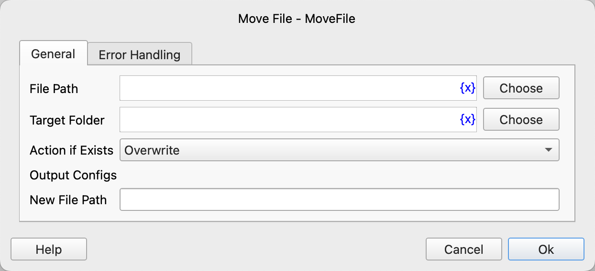

# Move File

Move a file.

## Instruction Configuration

### File Path

Enter or select the path of the file to be moved.

### Target Folder

Enter or select the target folder to move the file to.

### Action if Exists

If the target file already exists, you can choose to perform the following actions:

* Overwrite
* Auto Rename
* Perform Error Handling

### New File Path

Enter the variable name to save the new file path.

### Error Handling

If the instruction execution encounters an error, execute error handling. For details, refer to [Error Handling for Instructions](../../manual/error_handling.md).
