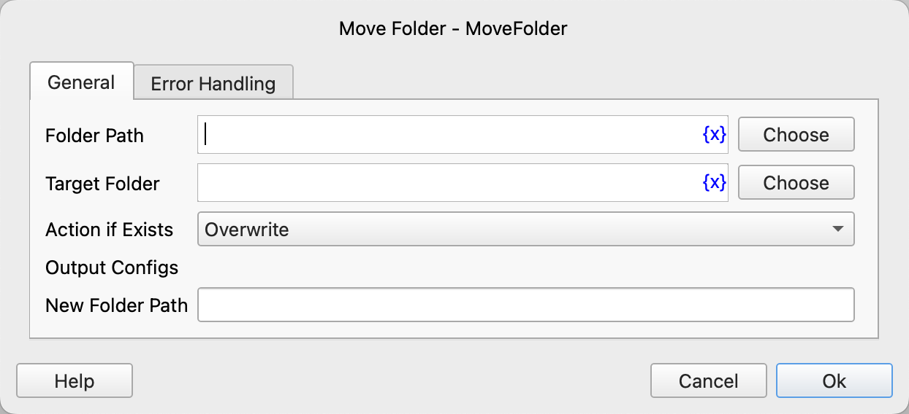

# Move Folder

Move a folder.

## Instruction Configuration

### Folder Path

Enter or select the path of the folder to be moved.

### Target Folder

Enter or select the target folder to which the folder will be moved.

### Action if Exists

If the new folder path to which the folder is being moved already exists, you can choose to perform the following actions:

* Overwrite
* Auto Rename
* Perform Error Handling

### New Folder Path

Enter the variable name to save the new folder path.

### Error Handling

If the instruction execution encounters an error, error handling will be executed. For details, refer to [Error Handling for Instructions](../../manual/error_handling.md).
