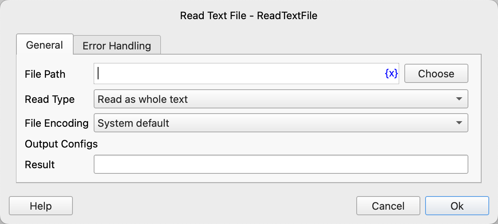

# Read Text File

Read a text file.

## Instruction Configuration

### File Path

Enter or select the path of the text file.

### Read Type

Choose the read type, options include: Read as Complete Text, Read as Line List.

### File Encoding

Select the file encoding.

### Result

Enter the variable name to save the read result.

### Error Handling

If the instruction execution encounters an error, error handling will be performed. For details, refer to [Error Handling for Instructions](../../manual/error_handling.md).