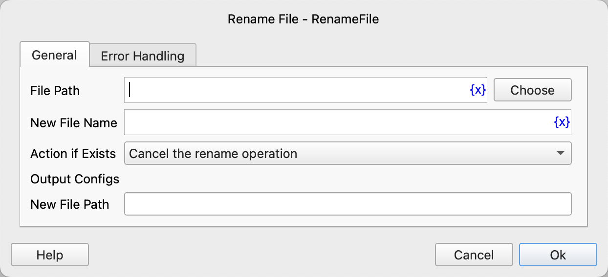

# Rename File

Rename a file.

## Instruction Configuration

### File Path

Enter or select the file path to be renamed.

### New File Name

Enter the new file name.

### Action if Exists

If the target file already exists, you can choose to perform the following actions:

* Cancel the rename operation
* Overwrite

### New File Path

Enter the variable name to save the new file path.

### Error Handling

If the instruction execution encounters an error, error handling will be performed. For details, refer to [Error Handling for Instructions](../../manual/error_handling.md).
