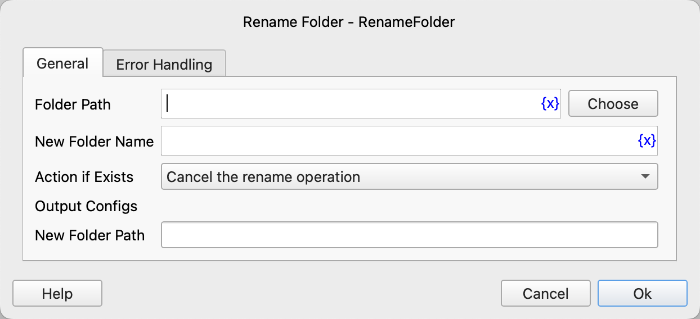

# Rename Folder

Rename a folder.

## Instruction Configuration

### Folder Path

Enter or select the path of the folder to be renamed.

### New Folder Name

Enter the new folder name.

### Action if Exists

If the target folder already exists, you can choose to perform the following actions:

* Cancel the rename operation
* Overwrite

### New Folder Path

Enter the variable name to save the new folder path.

### Error Handling

If the instruction execution encounters an error, error handling will be performed. For details, refer to [Error Handling for Instructions](../../manual/error_handling.md).