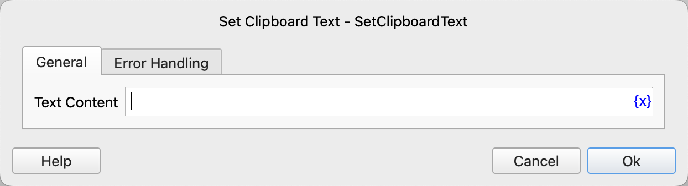

# Set Clipboard Text

Copy the text specified by the instruction to the clipboard.

## Instruction Configuration

### Text Content

Enter the text to be copied to the clipboard.

### Error Handling

If an error occurs during the execution of the instruction, error handling will be performed. For details, refer to [Error Handling for Instructions](../../manual/error_handling.md).