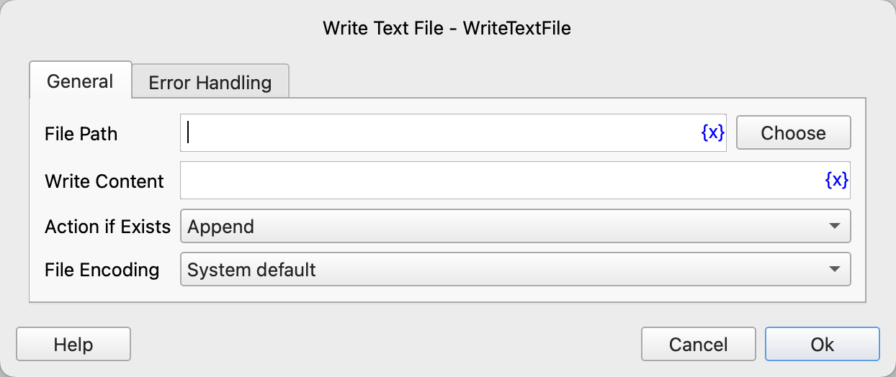

# Write Text File

Write to a text file.

## Instruction Configuration

### File Path

Enter or select the path of the text file.

### Write Content

Enter the text content to be written.

### Action if Exists

Choose whether to overwrite or append content if the file already exists.

### File Encoding

Select the encoding of the text file.

### Error Handling

If the instruction execution fails, error handling will be performed. For details, refer to [Error Handling for Instructions](../../manual/error_handling.md).