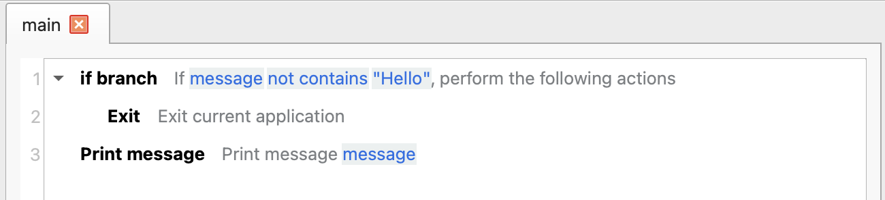
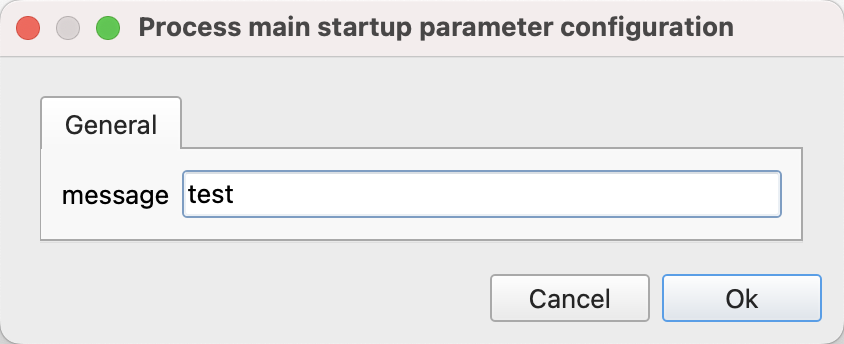
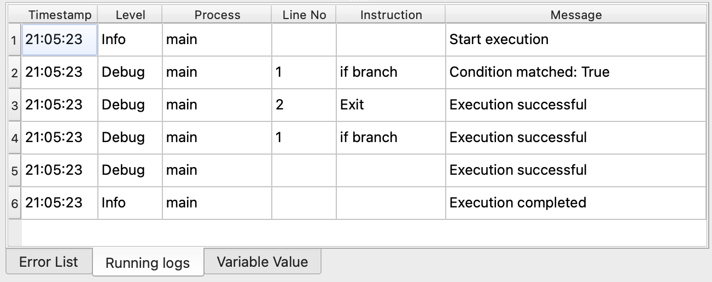

# Exit

End the execution of the current application.

## Instruction Configuration

This instruction has no configuration parameters.

## Usage Example

The execution logic of this process is as follows:

1. Check if the input parameter "message" contains the word "Hello". If it does not, terminate the application.
2. Otherwise, print the message.

Application download link: [Example Application of Exit](../../examples/exit_demo.zip)
