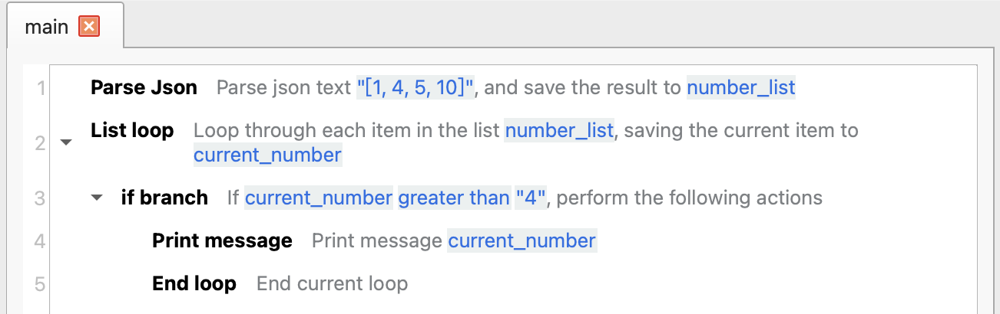
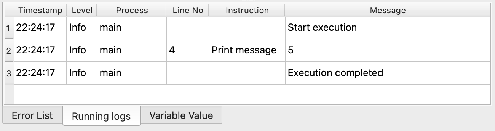

# End Loop

Used to end the loop within the loop body of a loop instruction and then execute other instructions following the loop.

## Instruction Configuration

This instruction has no configuration parameters.

## Usage Example

This process is used to find the first number greater than 4 in the list.

The execution logic of this process is as follows:

1. Parse the JSON list data and save it to the variable `number_list`.
2. Loop through each number in the `number_list`.
    1. If the number is greater than 4, print the number and end the loop.

Run Log:

