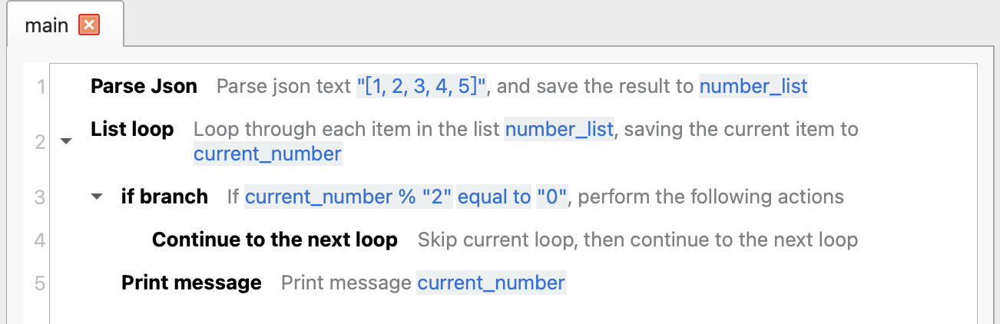
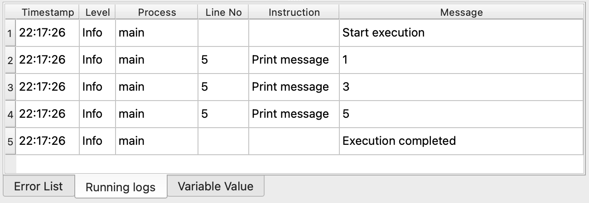

# Continue to the Next Loop

It is used to skip the current loop in the loop body of a loop instruction and continue to execute the next loop.

## Instruction Configuration

This instruction has no configuration parameters.

## Usage Example

This process is used to print all odd numbers in the list.

The execution logic of this process is as follows:

1. Parse the JSON list data and save it to the variable `number_list`.
2. Loop through each number in the `number_list`.
    1. If the number is even, continue to the next loop.
    2. Otherwise, print the current number.

Running Log:

