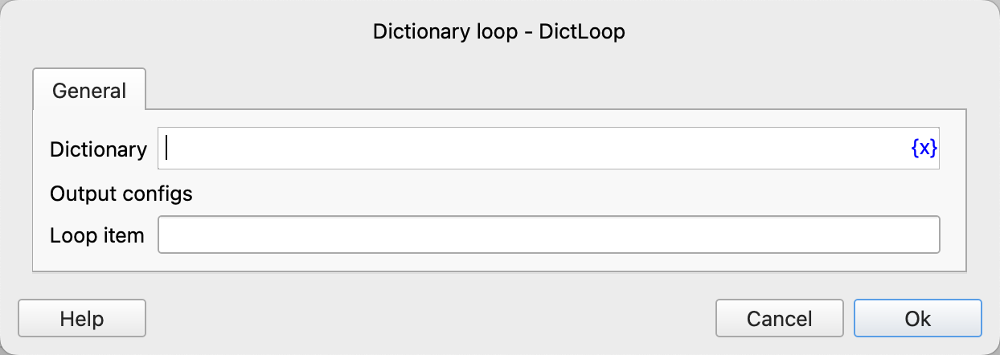

# Dictionary Loop

Loop through each key-value pair in the dictionary and then execute the instructions within the loop.

## Instruction Configuration

### Dictionary

Enter the dictionary expression to be traversed.

### Loop Item

Enter the variable name used to save the key-value pairs in the dictionary. Each key-value pair is a list, where the first element is the key and the second element is the value.

## Usage Example

The execution logic of this process is as follows:

1. Parse the JSON dictionary data and save it to the variable `dictionary`.
2. Loop through each key-value pair in the `dictionary`, save the current key-value pair to the variable `current_value`, and then execute the instructions within the loop.
    1. Print the key and value of the key-value pair.

Running Log:

