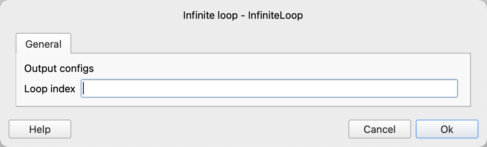
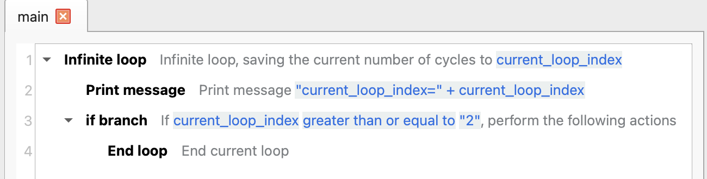
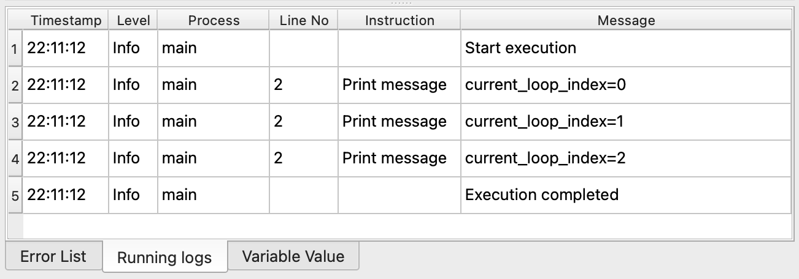

# Infinite Loop

The infinite loop executes the contained instructions until the loop is terminated using other flow control instructions within the loop body.

Instructions that can end the loop include: [End Loop](break.md), [Return](../return.md), [Exit](../exit.md)

## Instruction Configuration

### Loop Position

Enter the variable name used to save the current loop index position. The loop position is an integer starting from 0.

## Usage Example

The execution logic of this process is as follows:

1. In an infinite loop, save the current loop position to the variable `current_loop_index`, and then execute the instructions within the loop.
    1. Print the value of `current_loop_index`
    2. Check if `current_loop_index` is greater than or equal to 2. If so, end the loop.

Running Log:

