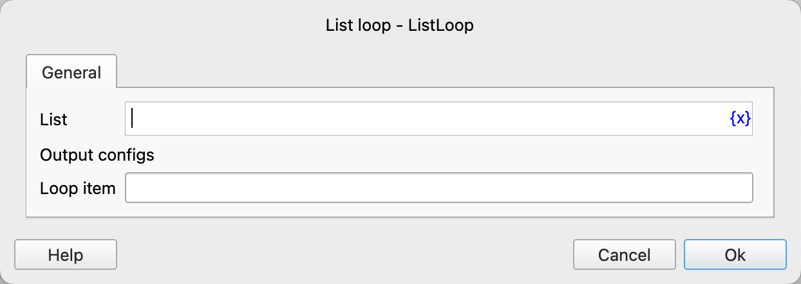
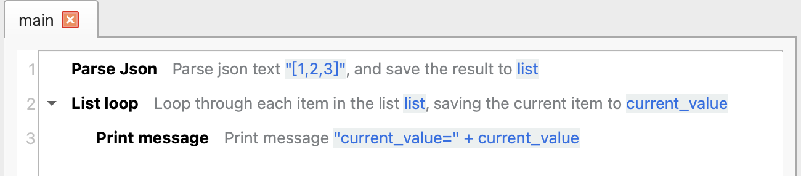
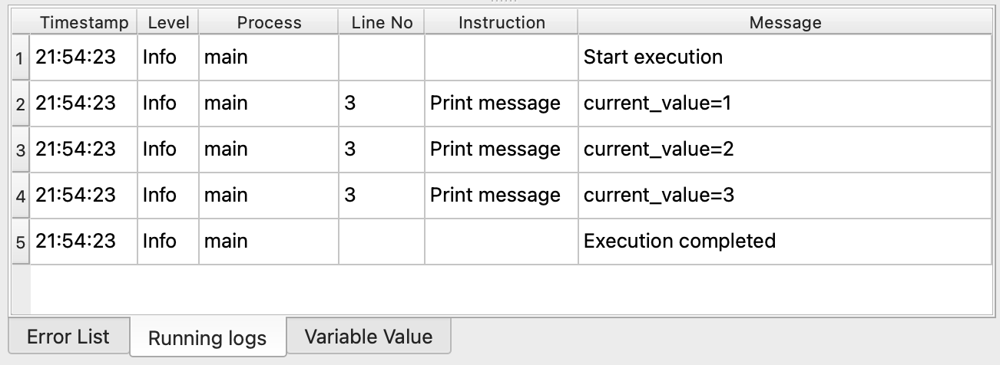

# List Loop

Loop through each element in the list and then execute the instructions within the loop.

## Instruction Configuration

### List

Enter the list expression to be traversed.

### Loop Item

Enter the variable name used to save the elements in the list.

## Usage Example

The execution logic of this process is as follows:

1. Parse the JSON list data and save it to the variable `list`.
2. Loop through each element in the `list`, save the current item to the variable `current_value`, and then execute the instructions within the loop.
    1. Print the variable `current_value`.

Running Log:

Application download link: [Example Application of List Loop](../../../examples/list_loop_demo.zip)
