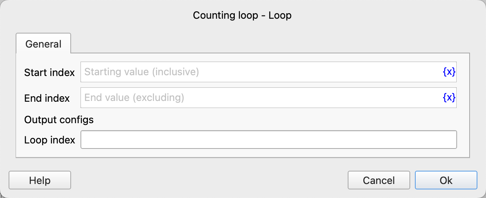
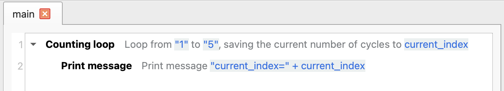
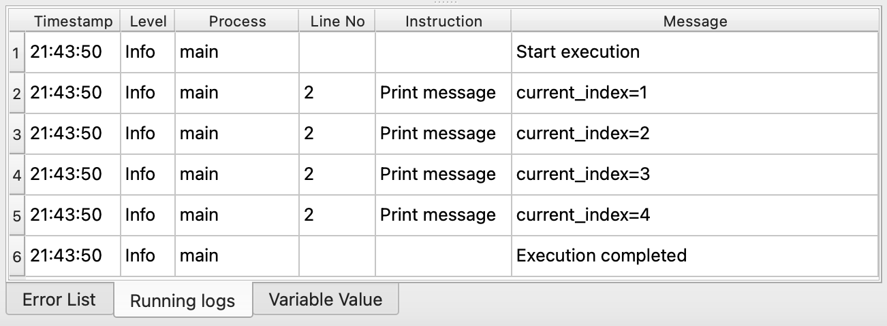

# Counting Loop

Repeatedly execute the included instructions within the specified counting range.

## Instruction Configuration

### Starting Index

The starting index of the loop, including this value, must be an integer, such as "0".

### Ending Index

The ending index of the loop, not including this value, must be an integer, such as "10".

## Usage Example

The execution logic of this process is as follows:

1. Loop from 1 (inclusive) to 5 (exclusive), and save the current loop count to the variable `current_index`.
    1. Print the current index in each loop.

Running Log:

Application download link: [Example Application of Counting Loop](../../../examples/loop_demo.zip)
