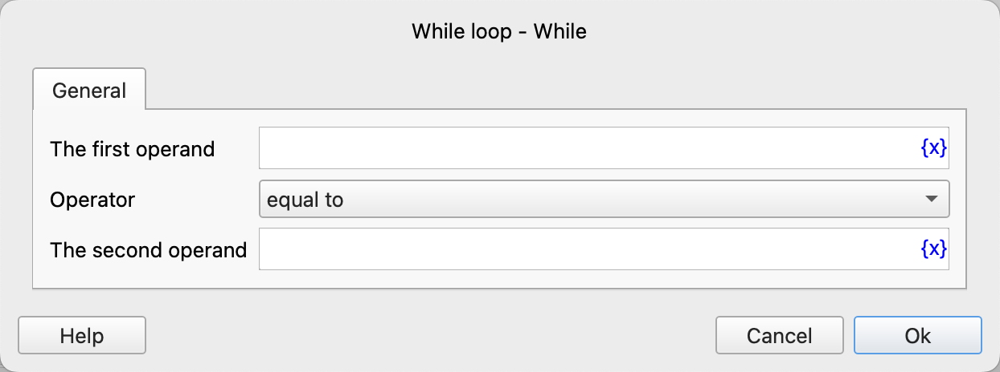
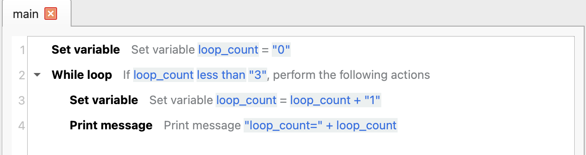
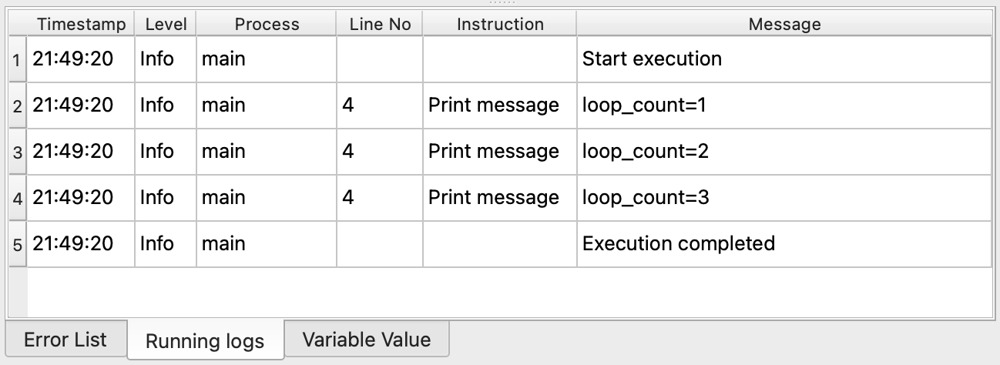

# While Loop

Determine whether the specified condition is met. If it is, repeatedly execute the included instructions until the condition is no longer met.

## Instruction Configuration

### First Operand

Enter the expression of the first operand, such as variables, strings, numerical values, etc.

### Operator

Select the comparison operator to use. The currently supported operators are: equal to, not equal to, greater than, less than, greater than or equal to, less than or equal to, contains, not contains, is empty, is not empty, starts with, not starts with, ends with, not ends with, is true, is false.

### Second Operand

Except for "is empty", "is not empty", "is true", "is false", other operators also require entering the second operand.

## Usage Example

The execution logic of this process is as follows:

1. Set the variable `loop_count` and assign it a value of 0.
2. If `loop_count` is less than 3, repeatedly execute the following instructions.
    1. Increment `loop_count` by 1.
    2. Print the loop count.

Run Log:

