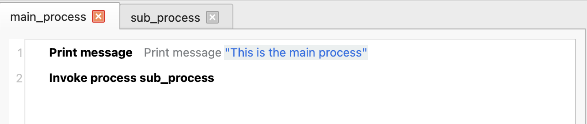
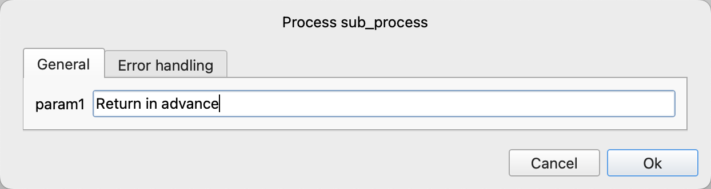
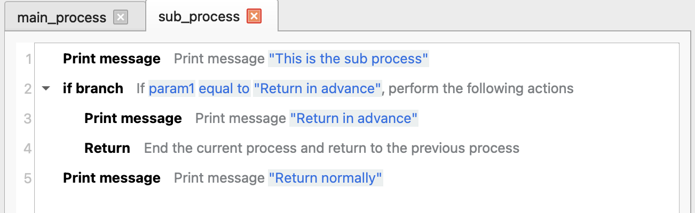
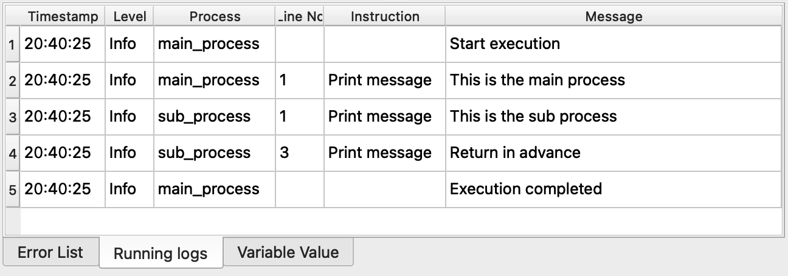

# Return

For complex applications, we can divide the application into multiple processes, and then call sub - processes in the parent process. This instruction is used to return from the sub - process to the parent process in advance.

## Instruction Configuration

This instruction has no configuration parameters.

## Usage Example

Execution logic of the main process:

1. Print the message "This is the main process".
2. Call the sub - process and set parameter 1 to "Return in advance".

Execution logic of the sub - process:

1. Check if parameter 1 is "Return in advance". If so, print the message and return to the main process in advance.
2. Otherwise, print the message and return normally.

Running Log:

