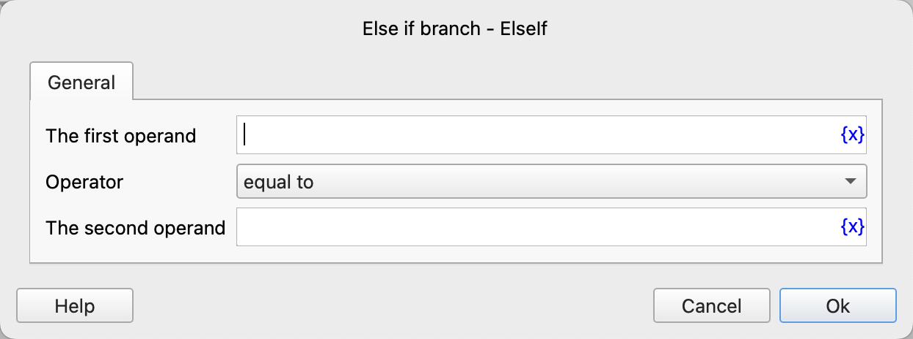
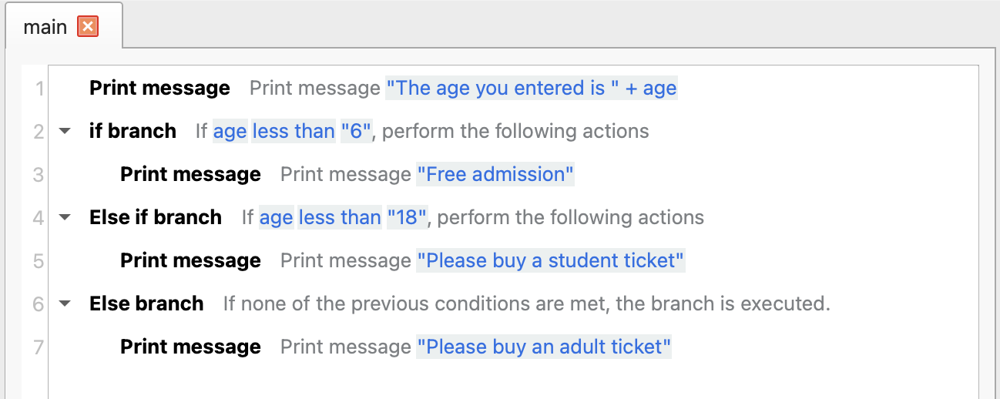
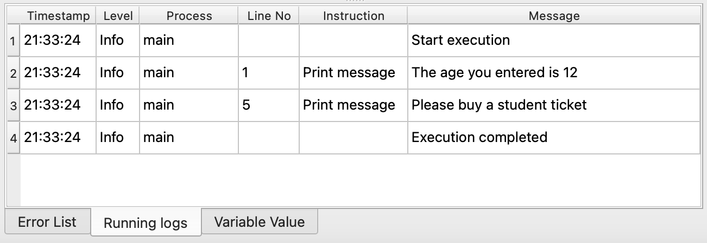

# Else If Branch

It is used in combination with an If branch or other Else If branches. When the previous conditional branches are not satisfied, it continues to check whether the condition of the current branch is met. If it is met, all the included instructions will be executed.

## Instruction Configuration

### First Operand

Enter the expression of the first operand, such as variables, strings, numerical values, etc.

### Operator

Select the comparison operator to use. The currently supported operators are: equal to, not equal to, greater than, less than, greater than or equal to, less than or equal to, contains, not contains, is empty, is not empty, starts with, not starts with, ends with, not ends with, is true, is false.

### Second Operand

Except for "is empty", "is not empty", "is true", "is false", other operators also require entering the second operand.

## Usage Example

The execution logic of this process is as follows:

1. Print the input age.
2. Check if the age is less than 6. If so, print the message "Free admission".
3. Otherwise, continue to check if the age is less than 18. If so, print the message "Please buy a student ticket".
4. Otherwise, print the message "Please buy an adult ticket".

Running Log:

Application download link: [Example Application of Else If Branch](../../../examples/else_if_demo.zip)
