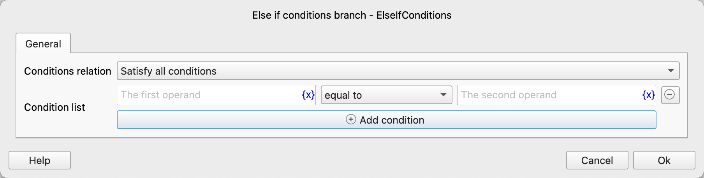

# Else if conditions branch

Used in combination with an If branch or other Else If branches. When the previous conditional branches are not satisfied, continue to check whether the current branch condition is met. If it is, execute all the included instructions.

This instruction is similar to the [Else If Branch Instruction](else_if.md), but it supports simultaneously checking whether multiple conditions meet the specified relationships.

## Instruction Configuration

### Condition Relationship

Select the logical relationship between multiple conditions: meet all conditions or meet any condition.

### Condition List

Configure the condition list. Each condition consists of operands and an operator.

## Usage Examples

Refer to the usage examples of [If conditions branch Instruction](if_conditions.md#example) and [Else if branch Instruction](else_if.md#example).
