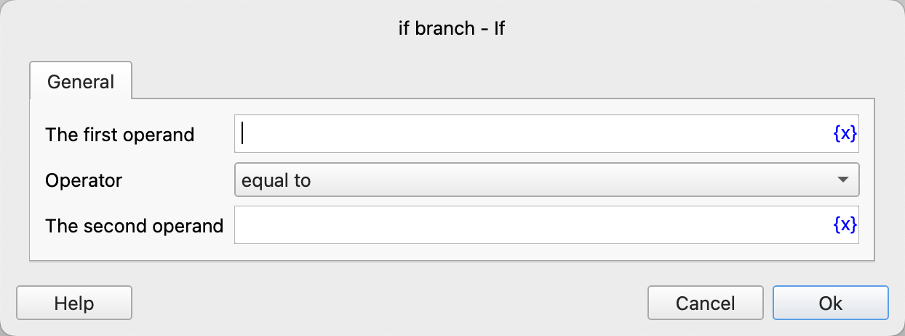
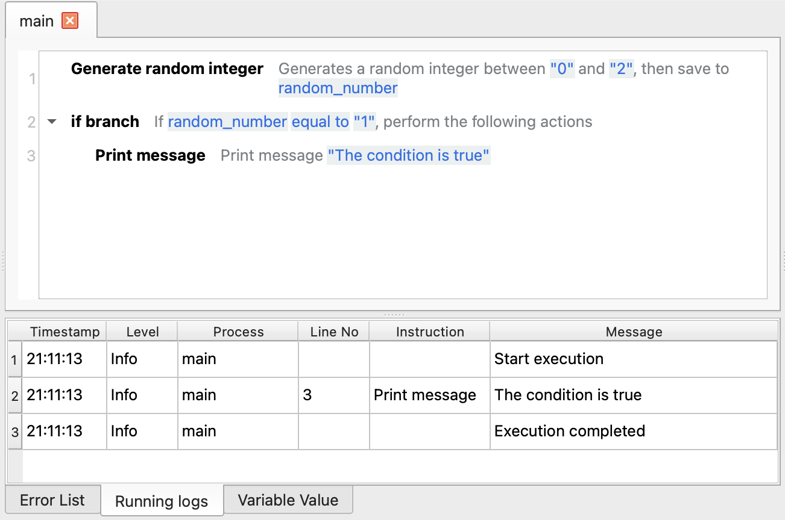

# If Branch

Determine whether the specified condition is true. If it is true, execute all the included instructions.

## Instruction Configuration

### First Operand

Enter the expression of the first operand, such as variables, strings, numerical values, etc.

### Operator

Select the comparison operator to use. The currently supported operators are: equal to, not equal to, greater than, less than, greater than or equal to, less than or equal to, contains, not contains, is empty, is not empty, starts with, not starts with, ends with, not ends with, is true, is false.

### Second Operand

Except for "is empty", "is not empty", "is true", "is false", other operators also require entering the second operand.

## Usage Example

The execution logic of this process is as follows:

1. Generate a random integer between 0 (inclusive) and 2 (exclusive), and then save it to the process variable `random_number`.
2. Determine whether the process variable `random_number` is equal to 1. If it is equal, execute the instructions included in the If branch, that is, print the message "The condition is true".

Execute the process multiple times, and you can see that the message "The condition is true" will only be printed when the `random_number` is 1.

Application download link: [Example Application of If Branch](../../../examples/if_demo.zip)
