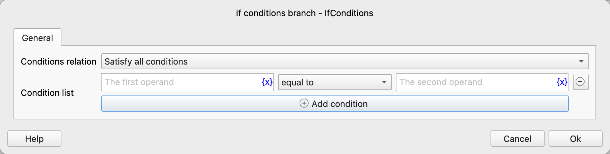
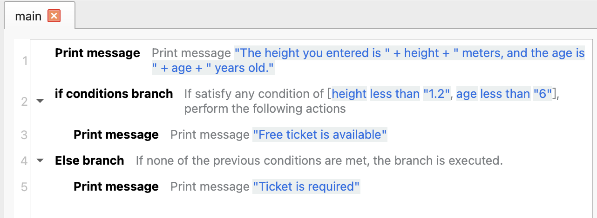
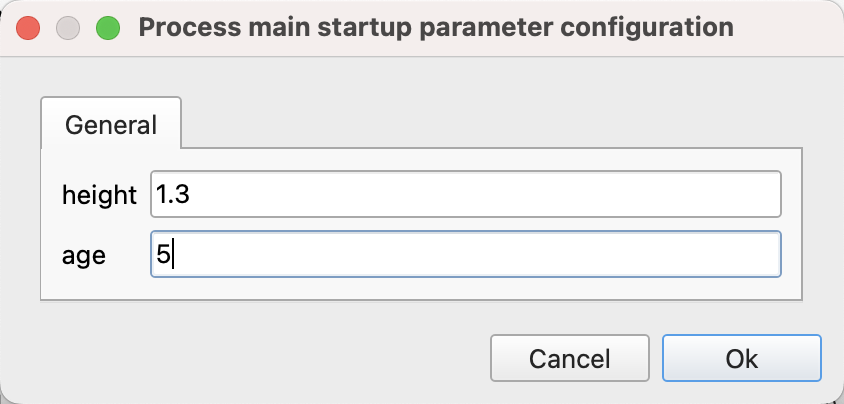
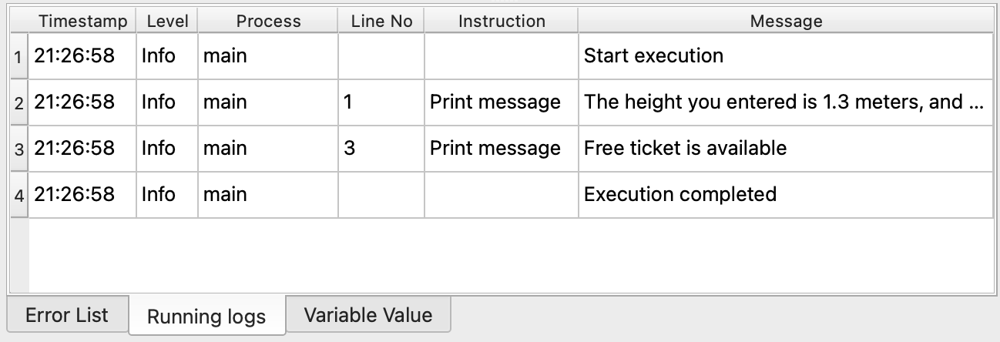

# If conditions branch

Simultaneously judge whether multiple conditions meet the specified relationships. If they do, execute all the included instructions.

## Instruction Configuration

### Condition Relationship

Select the logical relationship among multiple conditions: meet all conditions or meet any condition.

### Condition List

Configure the condition list. Each condition consists of operands and an operator.

## Usage Example

The execution logic of this process is as follows:

1. Print the height and age entered by the user.
2. Check if the height is less than 1.2 meters or the age is less than 6 years old. If either condition is met, print the message "Free ticket is available".
3. Otherwise, print the message "Ticket is required".

Running Log:

Application download link: [Example Application of If conditions branch](../../../examples/if_conditions_demo.zip)
