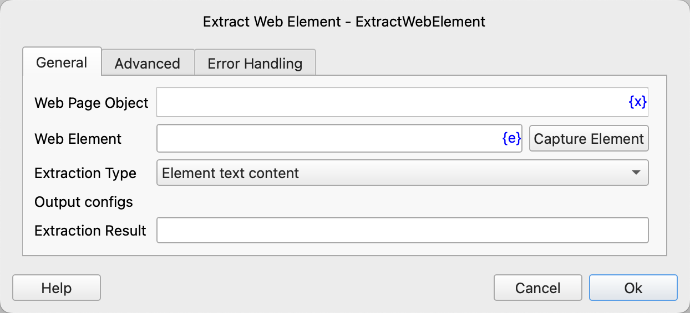
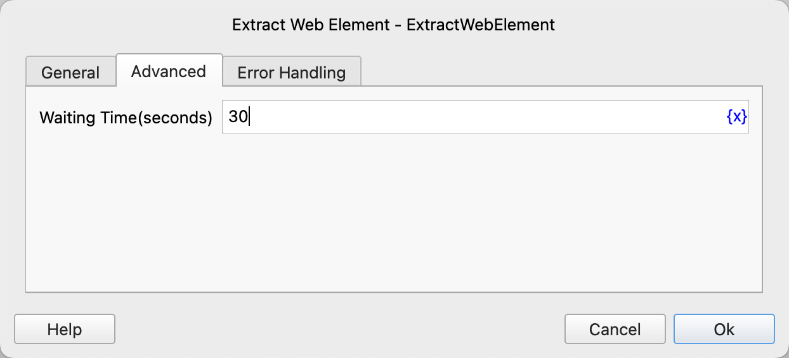

# Extract Web Element

Obtain various types of data of web elements, such as element content, element attributes, etc.

## Instruction Configuration

### Web Page Object

Select the web page object to operate on.

### Web Element

Select a web element from the element library, or click the "Capture Element" button to use the tool to obtain it. For details, please refer to [Web Element Capture Tool](../../../manual/web_element_capture_tool.md).

### Extraction Type

- Element Text Content: Obtain the text content of the element.
- Element HTML Source Code: Obtain the HTML source code of the element.
- Input Box Value: Obtain the value of the input box.
- Link Address: Obtain the address of the link element.
- Element Attribute Value: Obtain the value of the specified attribute.
- Element Position: Obtain the coordinate position of the element relative to the upper left corner of the web page, with the unit being pixels. The extraction result is a dictionary containing two fields, x and y.

### Attribute Name

When the extraction type is "Element Attribute Value", enter the attribute name to be obtained.

### Extraction Result

Enter the variable name used to save the extraction result.

### Waiting Time

The time to wait for the web element to appear, with the unit being seconds.

### Error Handling

If an error occurs during the execution of the instruction, perform error handling. For details, refer to [Error Handling of Instructions](../../../manual/error_handling.md).
