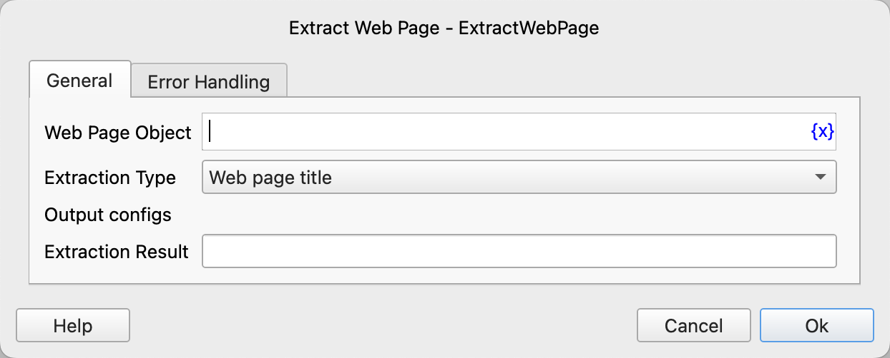

# Extract Web Page

Obtain information such as the title, links, and content of a web page.

## Instruction Configuration

### Web Page Object

Select the web page object to operate on.

### Extraction Type

- Web Page Title: Obtain the title of the web page.
- Web Page Url: Obtain the link address of the web page.
- Web Page HTML Source Code: Obtain the HTML source code of the web page.
- Web Page Text Content: Obtain the text content of the web page.

### Extraction Result

Enter the variable name used to save the extraction result.

### Error Handling

If an error occurs during the execution of the instruction, perform error handling. For details, see [Error Handling of Instructions](../../../manual/error_handling.md).
