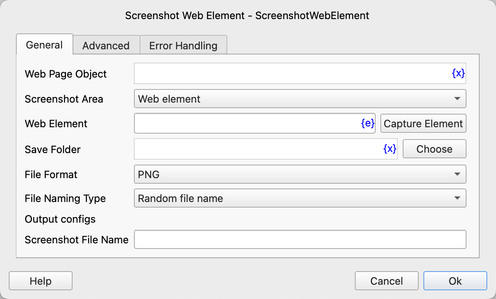
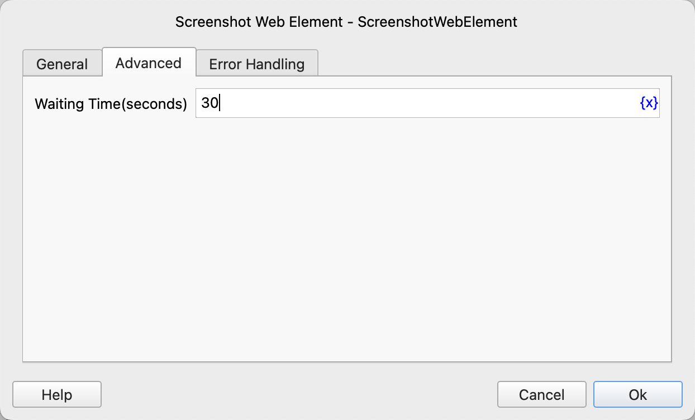

# Screenshot Web Element

Take a screenshot of a web page or web element.

## Instruction Configuration

### Web Page Object

Select the web page object to operate on.

### Screenshot Area

- Web Element: Take a screenshot of a web element.
- Visible Area of the Web Page: Capture the visible area of the web page.
- Entire Web Page: Capture the entire web page.

### Web Element

Select a web element from the element library, or click the "Capture Element" button to use the tool to obtain it. For details, please refer to [Web Element Capture Tool](../../../manual/web_element_capture_tool.md).

### Save Folder

Enter or select the folder path to save the screenshot file.

### File Format

Select the format to save the screenshot file. PNG and JPEG formats are supported.

### File Naming Type

Choose the file naming method, either a random file name or a custom file name.

### Custom File Name

If you choose a custom file name, enter the custom file name.

### Overwrite Existing File

If you choose a custom file name, select whether to overwrite files with the same name.

### Screenshot File Name

Enter the variable name used to save the path of the screenshot file.

### Waiting Time

The time to wait for the web element to appear, in seconds.

### Error Handling

If an error occurs during the execution of the instruction, perform error handling. For details, see [Error Handling of Instructions](../../../manual/error_handling.md).
