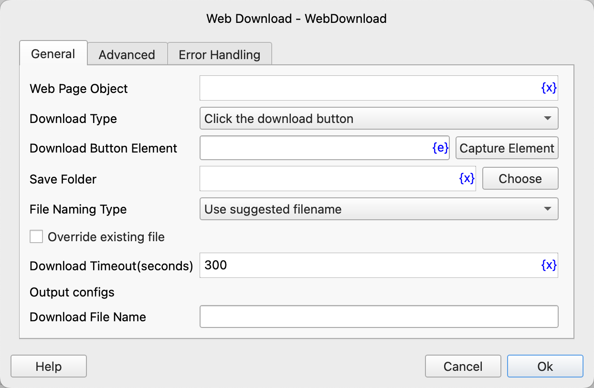
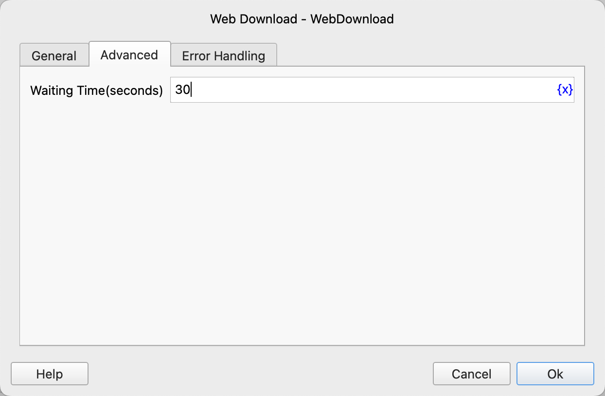

# Web Download

Download web page files.

## Instruction Configuration

### Web Page Object

Select the web page object to operate on.

### Download Type

- Click the Download Button: Download by clicking the button.
- Open the Download Link: Open the download link directly in the browser.

### Download Button Element

Select a web page element from the element library, or click the "Capture Element" button to call the tool to obtain it. For details, please refer to [Web Element Capture Tool](../../../manual/web_element_capture_tool.md).

### Download Address

If you choose to open the download link, you need to enter the link address of the file to be downloaded.

### Save Folder

Enter or select the folder path to save the downloaded file.

### File Naming Type

Select the file naming method, use the recommended file name or a custom file name.

### Custom File Name

If you choose a custom file name, enter the custom file name.

### Overwrite Existing Files

Select whether to overwrite files with the same name.

### Download Timeout

Enter the download timeout in seconds.

### Download File Name

Enter the variable name used to save the path of the downloaded file.

### Waiting Time

The time to wait for the download button or the download dialog box to appear, in seconds.

### Error Handling

If an error occurs during the execution of the instruction, perform error handling. For details, see [Error Handling of Instructions](../../../manual/error_handling.md).
