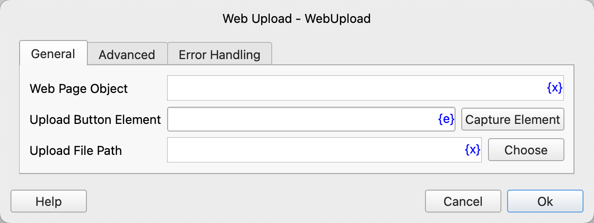
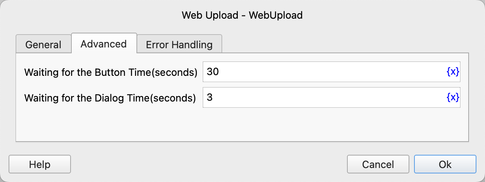

# Web Upload

Upload files through the web page.

## Instruction Configuration

### Web Page Object

Select the web page object to operate on.

### Upload Button Element

Select a web element from the element library, or click the "Capture Element" button to use the tool to obtain it. For details, please refer to [Web Element Capture Tool](../../../manual/web_element_capture_tool.md).

### Upload File Path

Enter or select the file path to be uploaded.

### Waiting for the Button Time

The time to wait for the upload button to appear, in seconds.

### Waiting for the Dialog Time

The time to wait for the file upload dialog box to appear, in seconds.

### Error Handling

If an error occurs during the execution of the instruction, perform error handling. For details, please refer to [Error Handling of Instructions](../../../manual/error_handling.md).
