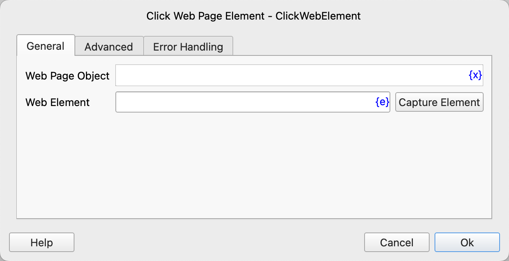
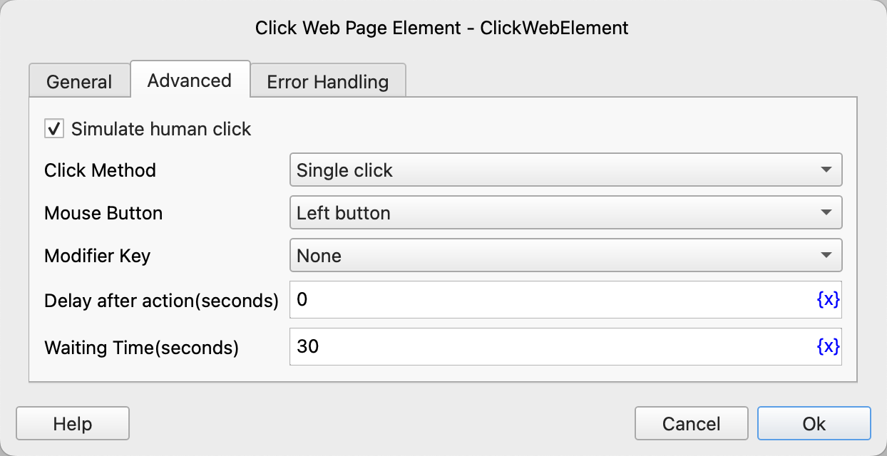

# Click Web Page Element

Simulate the operation of mouse - clicking web elements, such as buttons, links, etc.

## Instruction Configuration

### Web Page Object

Select the web page object to be operated.

### Web Element

Select a web element from the element library, or click the "Capture Element" button to call the tool to obtain it. For details, please refer to [Web Element Capture Tool](../../../manual/web_element_capture_tool.md).

### Simulate Human click

If checked, the web element to be clicked must be a single element, and it must be visible, unobstructed, and in an enabled state.

### Click Method

Single - click or double - click.

### Mouse Button

Left button, middle button, right button.

### Modifier Key

Select the modifier key to be pressed simultaneously. The available values are: None, Alt, Ctrl, Ctrl or Meta (automatically selected according to the operating system, Meta for MacOS and Ctrl for other operating systems), Meta, Shift.

### Delay after action

After executing the instruction, delay for a period of time before continuing to execute subsequent instructions. The unit is seconds.

### Waiting Time

The time to wait for the web element to appear. The unit is seconds.

### Error Handling

If an error occurs during the execution of the instruction, execute the error handling. For details, please refer to [Error Handling of Instructions](../../../manual/error_handling.md).
