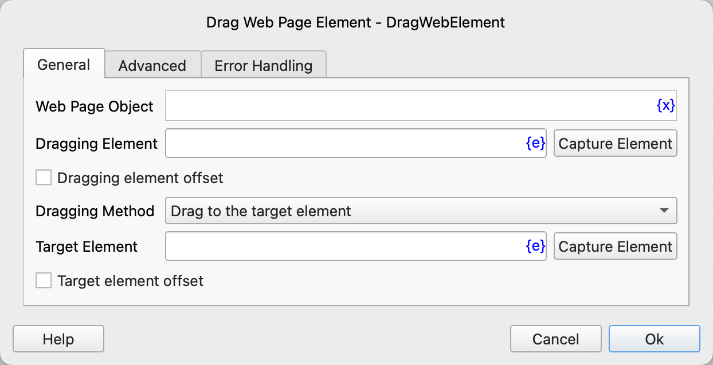
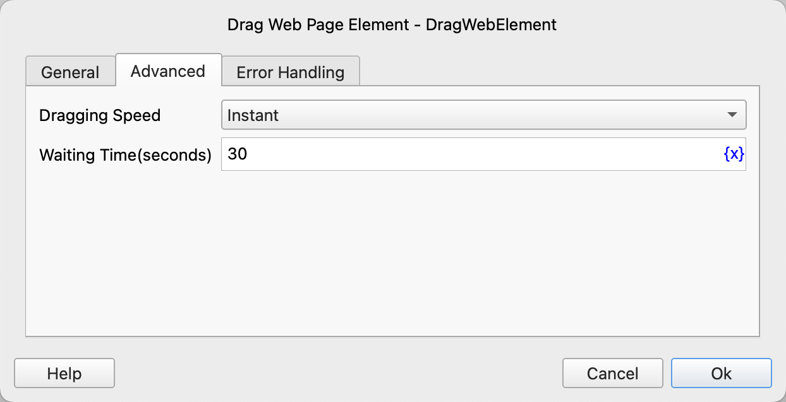

# Drag Web Page Element

Simulate the operation of dragging web elements with the mouse.

## Instruction Configuration

### Web Page Object

Select the web page object to be operated on.

### Dragging Element

Select a web element from the element library, or click the "Capture Element" button to call the tool to obtain it. For details, please refer to [Web Element Capture Tool](../../../manual/web_element_capture_tool.md).

### Dragging Element Offset

By default, the starting position of the mouse is the center of the element. If this option is checked, you can set the offset of the starting position relative to the upper-left corner of the element.

### Dragging Element X Coordinate Offset

The X-axis offset of the mouse starting position relative to the upper-left corner of the element, in pixels.

### Dragging Element Y Coordinate Offset

The Y-axis offset of the mouse starting position relative to the upper-left corner of the element, in pixels.

### Dragging Method

Select the dragging method. The available values are: Drag to the target element, Drag by a specified offset.

### Target Element

Select a web element from the element library, or click the "Capture Element" button to call the tool to obtain it. For details, please refer to [Web Element Capture Tool](../../../manual/web_element_capture_tool.md).

### Target Element Coordinate Offset

When dragging to the target element, by default, the ending position of the mouse is the center of the target element. If this option is checked, you can set the offset of the ending position relative to the upper-left corner of the target element.

### Target Element X Coordinate Offset

The X-axis offset of the mouse ending position relative to the upper-left corner of the target element, in pixels.

### Target Element Y Coordinate Offset

The Y-axis offset of the mouse ending position relative to the upper-left corner of the target element, in pixels.

### Dragging X Coordinate Offset

When the dragging method is selected as "Drag by a specified offset", enter the X-axis offset of the mouse ending position relative to the starting position, in pixels.

### Dragging Y Coordinate Offset

The Y-axis offset of the mouse ending position relative to the starting position, in pixels.

### Dragging Speed

Select the dragging speed. The available values are: Instant, Fast, Medium, Slow.

### Waiting Time

The time to wait for the web element to appear, in seconds.

### Error Handling

If an error occurs during the execution of the instruction, perform error handling. For details, see [Error Handling of Instructions](../../../manual/error_handling.md).
