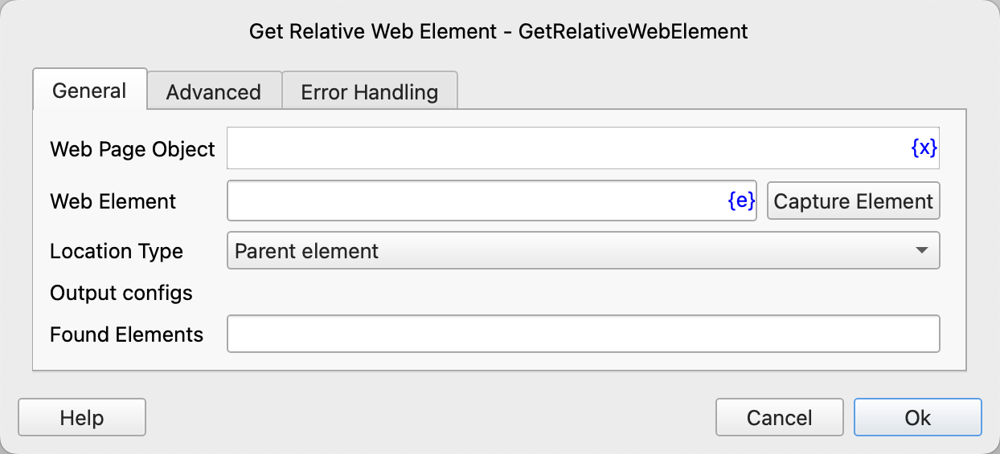
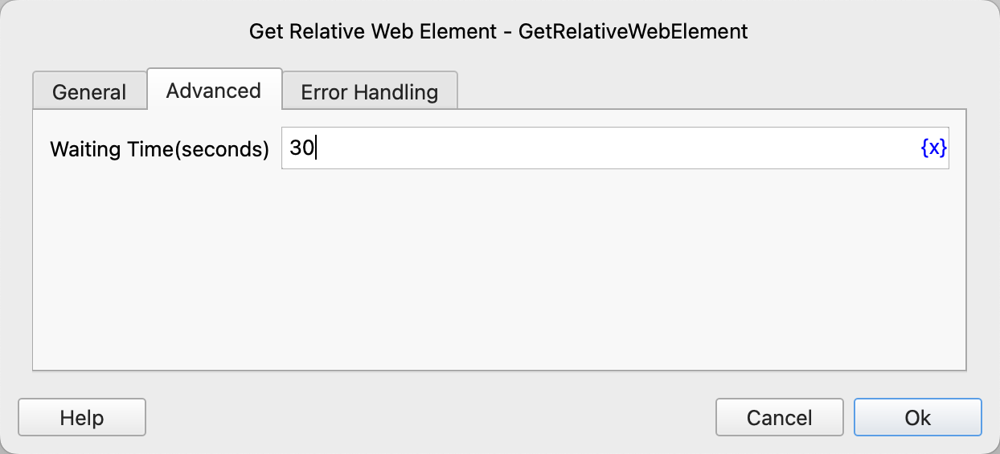

# Get Relative Web Element

Get the related elements of a specified element on a web page.

## Instruction Configuration

### Web Page Object

Select the web page object to operate on.

### Web Element

Select a web element from the element library, or click the "Capture Element" button to use the tool to obtain it. For details, please refer to [Web Element Capture Tool](../../../manual/web_element_capture_tool.md).

### Location Type

Select the location type of the related element. The available values are: parent element, previous sibling element, next sibling element, first matching descendant element, all matching descendant elements, all child elements, child element at a specified position.

### Relative XPath of Descendant Elements

If the location type is selected as the first matching descendant element or all matching descendant elements, you need to enter the relative XPath used to match the descendant elements.

In addition to manually entering the XPath, you can also click the "Get Relative XPath" button to use the tool to obtain it. For details, please refer to [Web Element Relative XPath Tool](../../../manual/web_element_relative_xpath_tool.md).

### Position of Child Element

If the location type is selected as the child element at a specified position, you need to enter the position of the element to be located in the parent element, starting from 0.

### Found Elements

Enter the process variable used to save the found element XPath or the list of element XPaths.

### Waiting Time

The time to wait for the specified web element to appear, in seconds.

### Error Handling

If an error occurs during the execution of the instruction, error handling will be performed. For details, please refer to [Error Handling of Instructions](../../../manual/error_handling.md).
