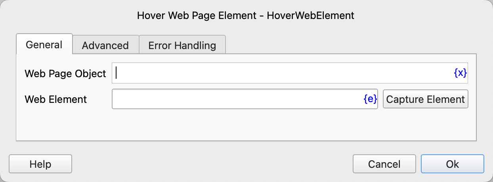
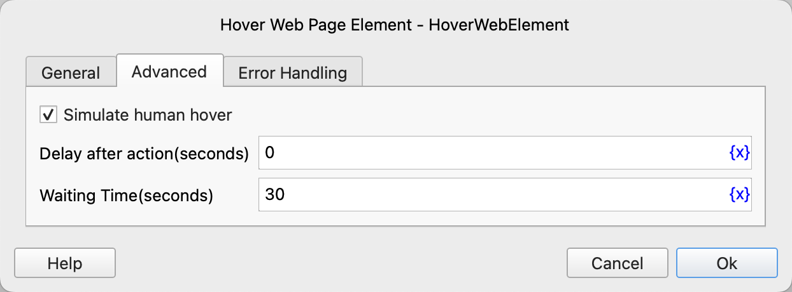

# Hover Web Page Element

Simulate the operation of hovering the mouse over web elements.

## Instruction Configuration

### Web Page Object

Select the web page object to be operated on.

### Web Element

Select a web element from the element library, or click the "Capture Element" button to use the tool to obtain it. For details, please refer to [Web Element Capture Tool](../../../manual/web_element_capture_tool.md).

### Simulate human hover

If checked, the web element to be hovered must be a single element, and it must be visible, not blocked, and in an enabled state.

### Delay after action

After executing the instruction, delay for a certain period of time before continuing to execute subsequent instructions. The unit is seconds.

### Waiting Time

The time to wait for the web element to appear. The unit is seconds.

### Error Handling

If an error occurs during the execution of the instruction, perform error handling. For details, see [Error Handling of Instructions](../../../manual/error_handling.md).
