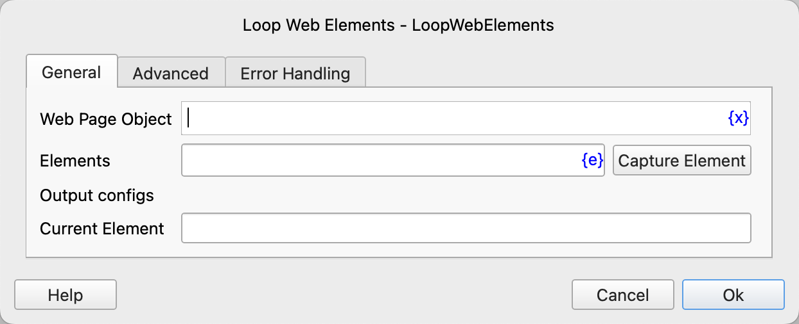
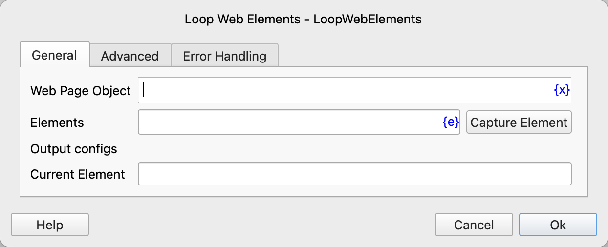

# Loop Web Elements

Loop through multiple web elements and then execute the instructions within the loop.

## Instruction Configuration

### Web Page Object

Select the web page object to operate on.

### Elements

Select a list of similar web elements from the element library, or click the "Capture Element" button to call the tool to obtain them. For details, please refer to [Web Element Capture Tool](../../../manual/web_element_capture_tool.md).

### Current Element

Enter the variable name used to save the Xpath of the currently traversed element for use in subsequent instructions.

### Loop in reverse order

Select whether to loop in reverse order.

### Waiting Time

The time to wait for the web element to appear, in seconds.

### Error Handling

If an error occurs during the execution of the instruction, error handling will be performed. For details, see [Error Handling of Instructions](../../../manual/error_handling.md).
