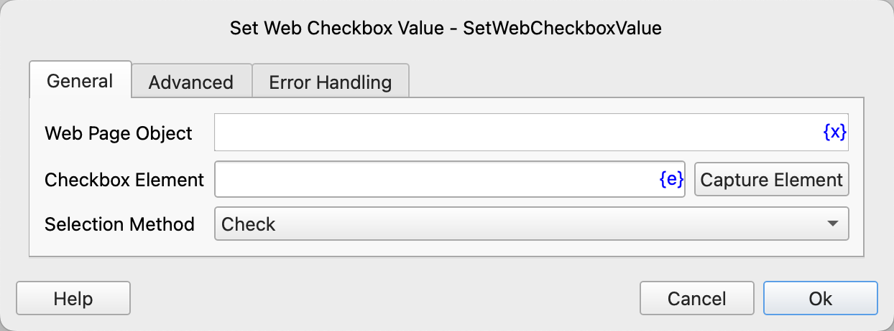
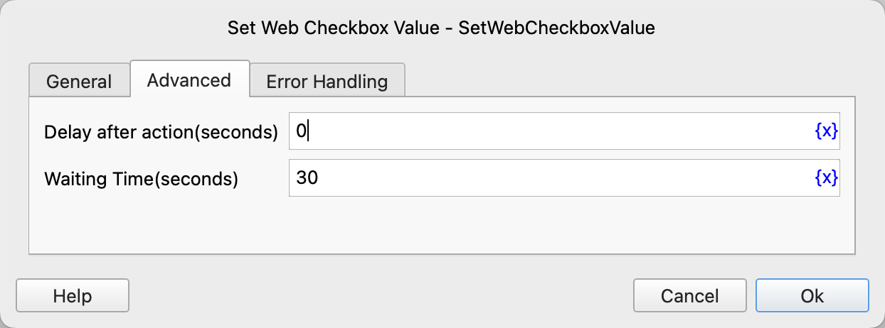

# Set Web Checkbox Value

Check or uncheck the checkbox on the web page.

## Instruction Configuration

### Web Page Object

Select the web page object to operate on.

### Checkbox Element

Select a web checkbox element from the element library, or click the "Capture Element" button to use the tool to obtain it. For details, please refer to [Web Element Capture Tool](../../../manual/web_element_capture_tool.md).

### Selection Method

Select the way to check the checkbox. The available values are: Check, Uncheck, Invert Selection.

### Delay after action

After executing the instruction, delay for a period of time before continuing to execute the subsequent instructions. The unit is seconds.

### Waiting Time

The time to wait for the input box to appear. The unit is seconds.

### Error Handling

If an error occurs during the execution of the instruction, perform error handling. For details, please refer to [Error Handling of Instructions](../../../manual/error_handling.md).
