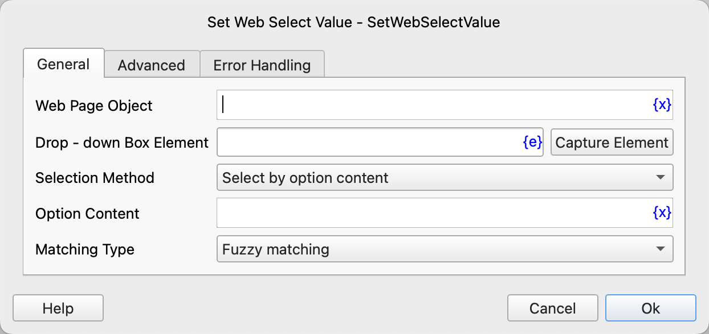
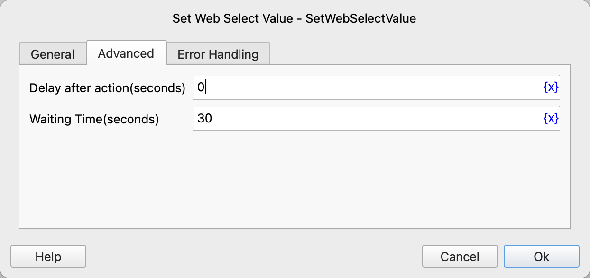

# Set Web Select Value

Set the value of the drop - down box on a web page.

## Instruction Configuration

### Web Page Object

Select the web page object to operate on.

### Drop - down Box Element

Select a web page drop - down box element from the element library, or click the "Capture Element" button to call the tool to obtain it. For details, please refer to [Web Element Capture Tool](../../../manual/web_element_capture_tool.md).

### Selection Method

Select the method of setting the drop - down box. The available values are: Select by Option Content, Select by Option Index.

### Option Content

If you choose to select by option content, you need to enter the option content to be selected.

### Matching Type

If you choose to select by option content, you need to select the matching method of the option content. The available values are: Fuzzy Matching, Exact Matching, Regular Expression Matching.

### Option Index

If you choose to select by option index, you need to enter the option index to be selected. The index starts from 0.

### Delay after action

After executing the instruction, delay for a period of time before continuing to execute the subsequent instructions. The unit is seconds.

### Waiting Time

The time to wait for the input box to appear. The unit is seconds.

### Error Handling

If an error occurs during the execution of the instruction, perform error handling. For details, please refer to [Error Handling of Instructions](../../../manual/error_handling.md).
