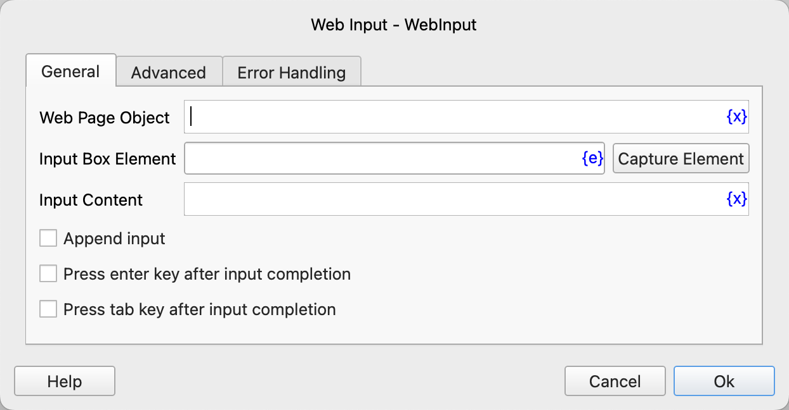
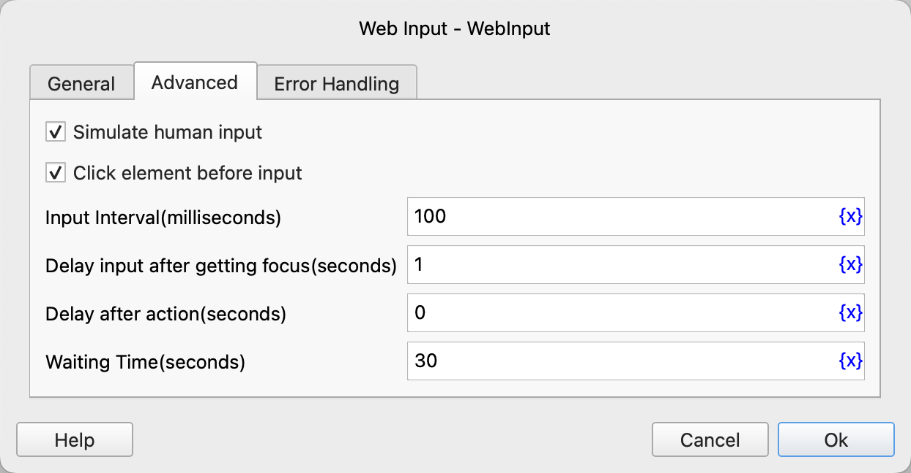

# Web Input

Fill the input boxes on the web page.

## Instruction Configuration

### Web Page Object

Select the web page object to operate on.

### Input Box Element

Select a web page input box element from the element library, or click the "Capture Element" button to call the tool to obtain it. For details, please refer to [Web Element Capture Tool](../../../manual/web_element_capture_tool.md).

### Input Content

Enter the content to be filled.

### Append Input

If checked, the input content will be appended to the original input content; otherwise, the original input content will be overwritten.

### Press Enter Key After Input Completion

If checked, the Enter key will be pressed after the input is completed.

### Press Tab Key After Input Completion

If checked, the Tab key will be pressed after the input is completed.

### Simulate Human Input

If checked, the data box located by Xpath must be a single element, and it must be visible, not blocked, and in an enabled state.

### Click Element Before Input

If checked, the specified element will be clicked before the input.

### Input Interval

The time interval between inputs, with the unit being milliseconds.

### Delay Input After Getting Focus

After getting focus, delay the input for a certain period of time, with the unit being seconds.

### Delay After Action

After executing the instruction, delay for a certain period of time before continuing to execute the subsequent instructions, with the unit being seconds.

### Waiting Time

The time to wait for the input box to appear, with the unit being seconds.

### Error Handling

If an error occurs during the execution of the instruction, error handling will be performed. For details, please refer to [Error Handling of Instructions](../../../manual/error_handling.md).
