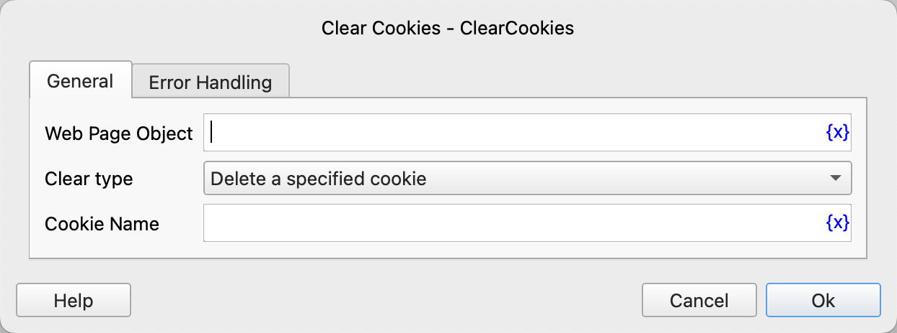

# Clear Cookies

Delete web page cookies.

## Instruction Configuration

### Web Page Object

Select the web page object for which you want to delete cookies.

### Clear Type

You can delete a specified cookie or clear all cookies.

### Cookie Name

Enter the name of the cookie to be deleted.

### Error Handling

If an error occurs during the execution of the instruction, perform error handling. For details, see [Error Handling of Instructions](../../../manual/error_handling.md).
