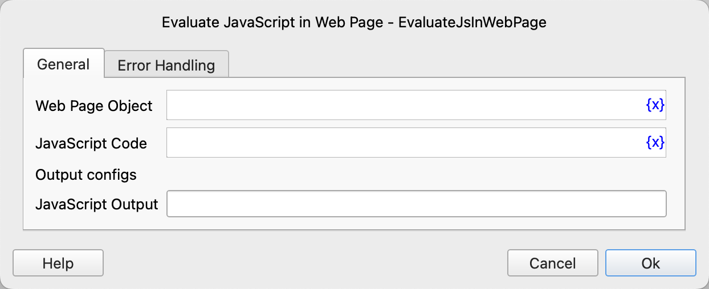

# Evaluate JavaScript in Web Page

Execute the JS code on the web page and then save the returned result to the process variable.

## Instruction Configuration

### Web Page Object

Select the web page object on which to execute the JS code.

### JavaScript Code

Enter the JS code.

### JavaScript Output

Enter the variable name used to save the returned result of the JS code.

### Error Handling

If an error occurs during the execution of the instruction, perform error handling. For details, see [Error Handling of Instructions](../../../manual/error_handling.md).
