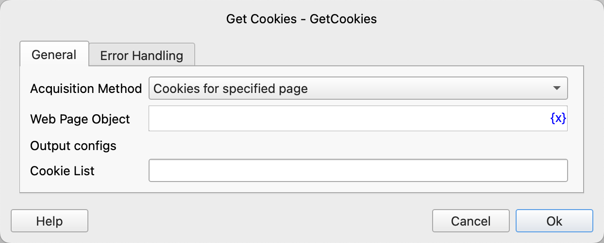

# Get Cookies

Get the cookies of a web page.

## Instruction Configuration

### Acquisition Method

You can get the cookies of a specified page or the cookies of a specified link.

### Web Page Object

Select the web page object from which to get the cookies.

### Web Browser Object

Select the web browser object from which to get the cookies.

### Web Page Address

Select the web page address from which to get the cookies.

### Cookie List

Enter the variable name used to save the cookie list.

The cookie list is composed of cookie dictionary objects. For the fields of the cookie dictionary object, see [Set Cookies](set_cookies.md#cookies).

### Error Handling

If an error occurs during the execution of the instruction, error handling will be performed. For details, see [Error Handling of Instructions](../../../manual/error_handling.md).
