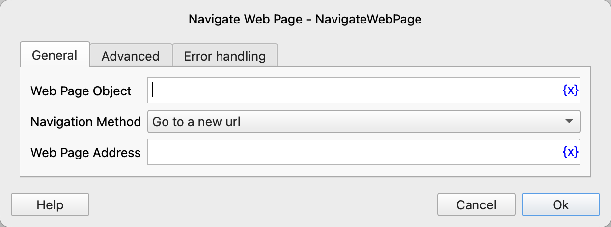
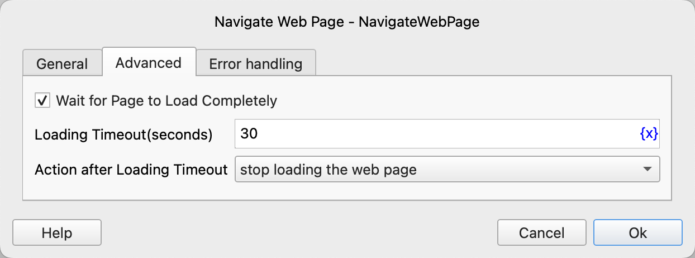

# Navigate Web Page

Navigate the web page object to a new URL.

## Instruction Configuration

### Web Page Object

Select the web page object to be navigated.

### Navigation Method

You can choose from the following four navigation methods:
1. Go to a new url
2. Go back
3. Go forward
4. Reload

### Web Page Address

If you choose to jump to a new link, enter the URL to navigate to.

### Wait for Page to Load Completely

Whether to wait for the page to load completely after navigation.

### Loading Timeout

The timeout for waiting for the page to load completely, in seconds.

### Action after Loading Timeout

The handling method after the loading times out. You can stop loading the web page or perform error handling.

### Error Handling

If the loading times out or an error occurs during the execution of the instruction, perform error handling. For details, see [Error Handling of Instructions](../../../manual/error_handling.md).
