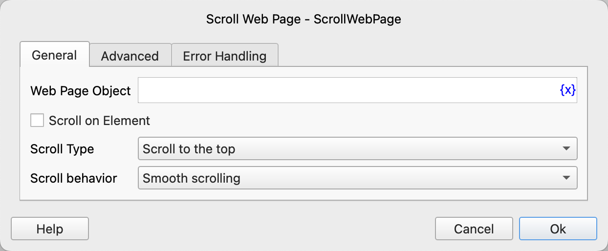
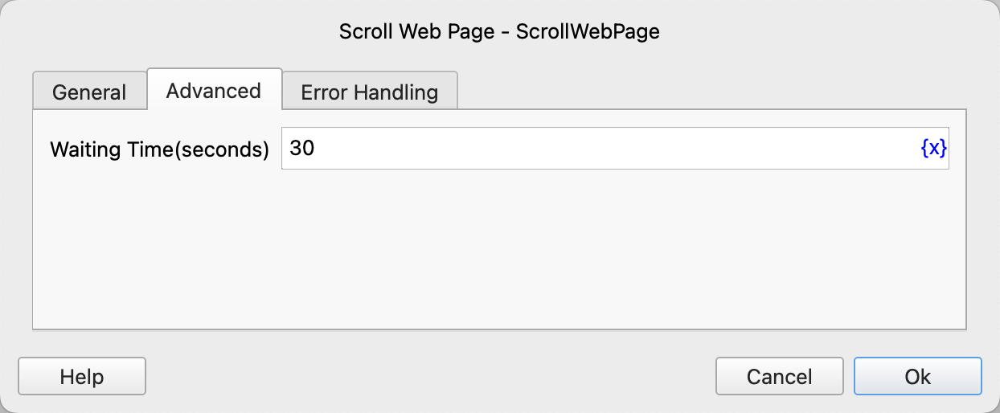

# Scroll Web Page

Perform scrolling operations on a web page.

## Instruction Configuration

### Web Page Object

Select the web page object to be scrolled.

### Scroll on Element

You can choose to scroll on a web element instead of the entire web page.

### Scroll Element

Select a web element from the element library or click the "Capture Element" button to use the tool to obtain it. For details, please refer to [Web Element Capture Tool](../../../manual/web_element_capture_tool.md).

### Find Scrollable Element Upward When the Element is Not Scrollable

If the element is not scrollable, find the first scrollable ancestor element upward.

### Scroll Type

The scroll type options are: scroll to the top, scroll to the bottom, scroll one screen, scroll to a specified element.

### Number of Scrolls

If you choose to scroll one screen, you need to enter the number of scrolls. A positive number scrolls down, and a negative number scrolls up.

### Scroll Interval

If you choose to scroll one screen, you need to enter the interval time between each scroll, in seconds.

### Scroll to Element

Select a web element from the element library or click the "Capture Element" button to use the tool to obtain it. For details, please refer to [Web Element Capture Tool](../../../manual/web_element_capture_tool.md).

### Scroll Method

The scroll method options are: smooth scrolling, instant scrolling.

### Waiting Time

The timeout for waiting for the element to appear, in seconds. If the waiting times out, the instruction will report an error and execute error handling.

### Error Handling

If the element waiting times out or the instruction execution encounters an error, execute error handling. For details, see [Error Handling of Instructions](../../../manual/error_handling.md).
