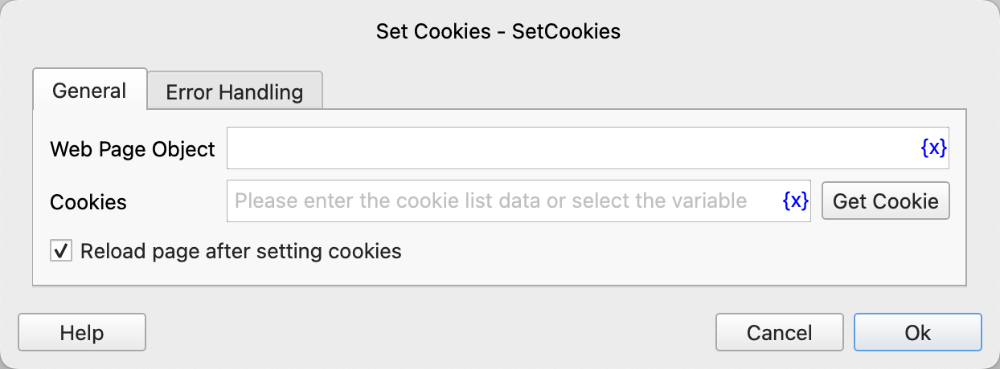

# Set Cookies

Set web page cookies.

## Instruction Configuration



### Web Page Object

Select the web page object for which to set cookies.

### Cookies

You can enter a list composed of cookie dictionary objects, or click the "Get Cookies Button" to call the tool to obtain them. For details, please refer to [Web Cookie Tool](../../../manual/web_cookie_tool.md).

Each cookie dictionary object contains the following fields:

* name: The name of the cookie.
* value: The value of the cookie.
* domain: Specify the domain name to which the cookie belongs, controlling which domain names can access the cookie. Usually, the domain of a cookie is set to the domain name of the currently accessed website (e.g., example.com). If a "." is added in front of the domain name, such as setting it to.example.com, then this domain name and all its sub - domains (e.g., sub.example.com) can access the cookie.
* path: Specify the path to which the cookie belongs, controlling that the cookie will only be sent under the specified path and its sub - paths. For example, if the path is set to /products, the cookie will only be sent when accessing /products and its sub - paths (e.g., /products/shoes).
* expires: The expiration time of the cookie. The value format is "yyyy - MM - ddTHH:mm:ss.zzz" + time zone. For example, "2024 - 11 - 12T06:36:09.612Z" represents the UTC time "2024 - 11 - 12 06:36:09.612", and the last 612 is milliseconds. "2024 - 11 - 12T14:36:09.612+08:00" represents Shanghai time "2024 - 11 - 12 14:36:09.612". These two times are the same moment, just in different time zones. If not specified, the cookie will be deleted when the browser is closed and is a "session cookie".
* httpOnly: Whether it is only accessible via HTTP. After setting it to true, the cookie can only be transmitted through the HTTP/HTTPS protocol and cannot be accessed via JavaScript (e.g., document.cookie).
* secure: After setting it to true, the cookie will only be sent under an HTTPS secure connection.
* sameSite: Controls the cross - site request behavior of the cookie and can be set to the following values:
    * Strict: Completely prohibits third - party websites from accessing the cookie. The cookie will only be sent when the request is from the same site.
    * Lax: Allows cross - site requests to carry the cookie under certain conditions. For example, it will be sent when navigating to other sites, but usually does not include form submissions and AJAX requests.
    * None: Allows cross - site requests to carry the cookie, but needs to be paired with the secure attribute.

Cookie Example:
```json
[
  {"name": "abc", "value": "123", "domain": ".example.com", "path": "/"}, 
  {"name": "efg", "value": "456", "domain": ".example.com", "path": "/", "expires": "2024 - 11 - 12T06:36:09.612Z", "httpOnly": true, "secure": true, "sameSite": "Strict"}
]
```

### Reload Page After Setting Cookies

Whether to reload the page after setting cookies to update the page content.

### Error Handling

If an error occurs during the execution of the instruction, error handling will be performed. For details, see [Error Handling of Instructions](../../../manual/error_handling.md).