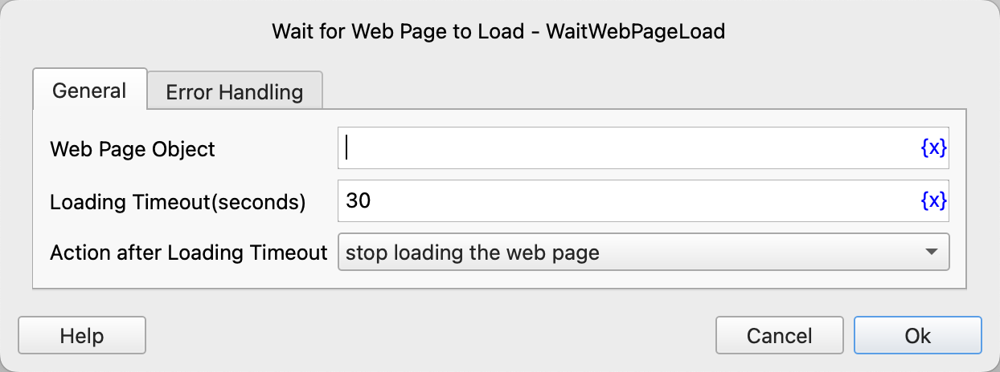

# Wait for Web Page to Load

Wait until the web page has finished loading before executing subsequent instructions.

## Instruction Configuration

### Web Page Object

Select the web page object to wait for.

### Loading Timeout

The timeout for waiting for the page to finish loading, in seconds.

### Action after Loading Timeout

The handling method after the loading times out. You can stop loading the web page or execute error handling.

### Error Handling

If the loading times out or an error occurs during instruction execution, execute error handling. For details, see [Error Handling of Instructions](../../../manual/error_handling.md).
