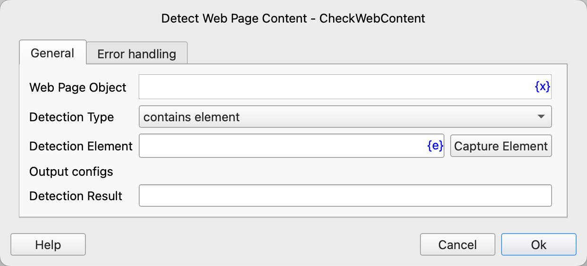

# Detect Web Page Content

Detect whether the content of a web page meets the specified conditions and save the detection result to a process variable.

## Instruction Configuration

### Web Page Object

Enter the web page object variable.

### Detection Type

The detection type can be selected from: contains element, does not contain element, contains text, does not contain text, element is visible, element is invisible, text is visible, text is invisible.

### Detection Element

Select a web element from the element library or click the "Capture Element" button to use the tool to obtain it. For details, please refer to [Web Element Capture Tool](../../manual/web_element_capture_tool.md).

### Detection Text

The text content to be detected.

### Detection Result

Enter the name of the process variable used to save the detection result. This result is a boolean variable. If the condition is met, the value is true; otherwise, it is false.

### Error Handling

If an error occurs during the execution of the instruction, perform error handling. For details, please refer to [Error Handling of Instructions](../../manual/error_handling.md).