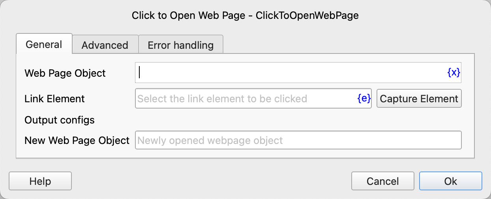
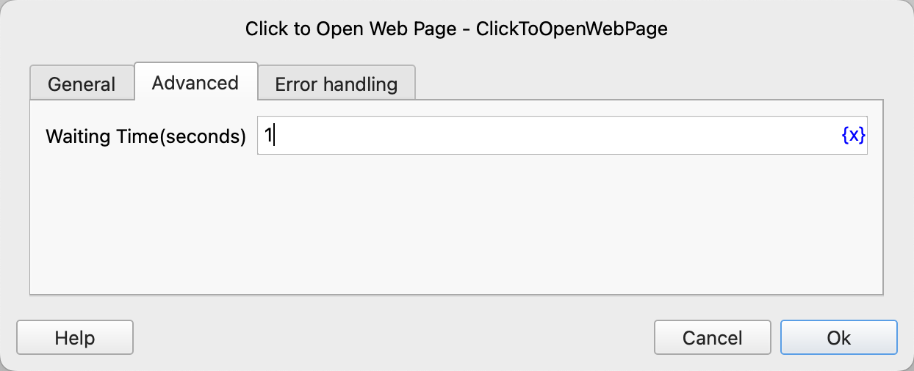

# Click to Open Web Page

Click the link on the web page to open a new web page and save the newly opened web page object into the process variable.

For links that open in the current window, please directly use the [Click Web Element](WebElementOperation/click_web_element.md) instruction. Do not use this instruction. This instruction is specifically for the situation of clicking to open a new window.

## Instruction Configuration

### Web Page Object

Select the web page object where the link to be clicked is located.

### Link Element

Select a link element from the element library or click the "Capture Element" button to call the tool for acquisition. For details, please refer to [Web Element Capture Tool](../../manual/web_element_capture_tool.md).

### New Web Page Object

Enter the name of the process variable used to save the newly opened web page object.

### Waiting Time

The time to wait for the new web page window to pop up, with a default of 1 second.

### Error Handling

If an error occurs during the execution of the instruction, error handling will be performed. For details, please refer to [Error Handling of Instructions](../../manual/error_handling.md).
