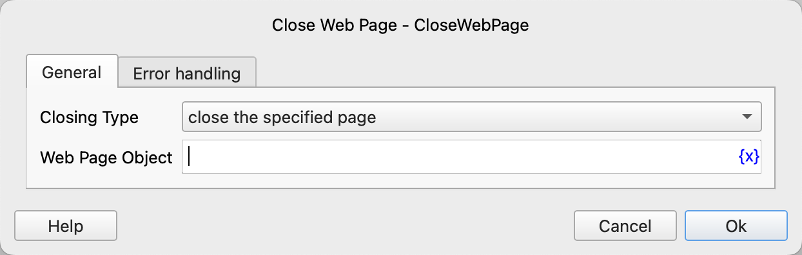

# Close Web Page

Close the web page or browser.

## Instruction Configuration

## Closing Type

For the closing type, you can choose: 

- close the specified page
- close the browser

### Web Page Object

Select the web page object to be closed.

### Web Browser

Select the browser to be closed.

### Error Handling

If an error occurs during the execution of the instruction, perform error handling. For details, see [Error Handling of Instructions](../../manual/error_handling.md).
