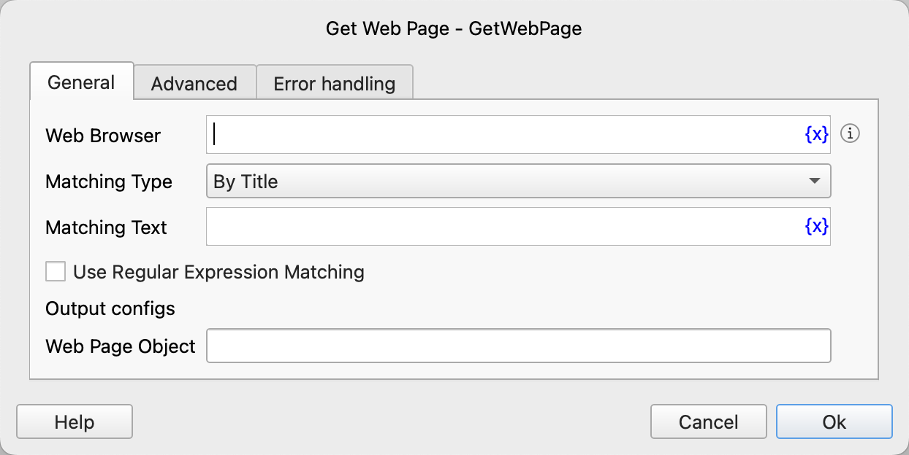
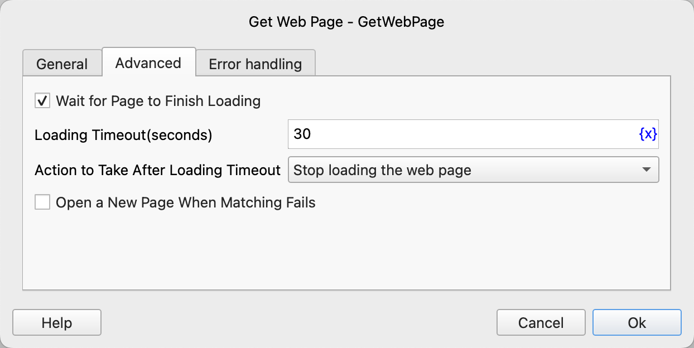

# Get Web Page

Find the specified web page in the currently open browser.

## Instruction Configuration

### Web Browser

Select the browser in which to find the web page.

### Matching Type

You can find the web page by title, by URL, or get the currently active web page.

### Matching Text

Enter the title or link text that needs to be matched.

### Use Regular Expression Matching

If this option is checked, the matching text will be treated as a regular expression.

### Web Page Object

Enter the name of the process variable used to save the found web page object.

### Wait for Page to Finish Loading

Select whether to wait for the page to finish loading.

### Loading Timeout

The timeout for waiting for the page to load completely.

### Action to Take After Loading Timeout

Set the action to take after the loading times out:

- Stop loading the web page
- Execute error handling

### Open a New Page When Matching Fails

Whether to open a new web page if the matching fails.

### Web Page Address

Enter the address of the web page to open.

### Error Handling

If the web page is not found or an error occurs during the execution of the instruction, execute error handling. For details, see [Error Handling of Instructions](../../manual/error_handling.md).
