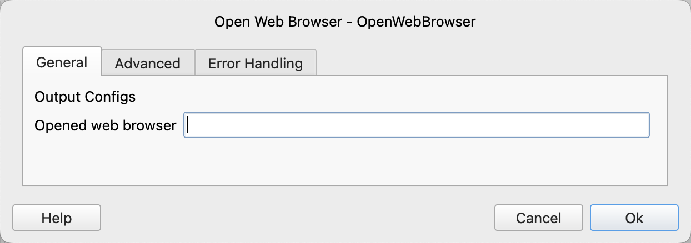
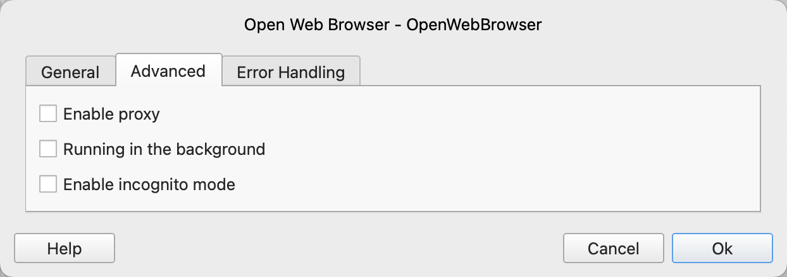

# Open Web Browser

Open the web browser.

## Instruction Configuration

### Newly Opened Web Browser

Enter the name of the process variable used to save the newly opened web browser.

### Enable Proxy

Configure whether to enable the proxy.

### Proxy server address

Enter the proxy server address.

HTTP and SOCKS proxies are supported, for example http://myproxy.com:3128 or socks5://myproxy.com:3128. Short form myproxy.com:3128 is considered an HTTP proxy.

### Proxy bypass

Enter comma-separated domains to bypass proxy, for example ".com, chromium.org, .domain.com".

### Proxy server username

Enter the proxy server username.

### Proxy server password

Enter the proxy server password.

### Running in the background

Configure whether to run the web browser in the background.

### Enable Incognito Mode
Configure whether to enable the incognito mode of the browser.

### Error Handling

If an error occurs during the execution of the instruction, perform error handling. For details, see [Error Handling of Instructions](../../manual/error_handling.md).
