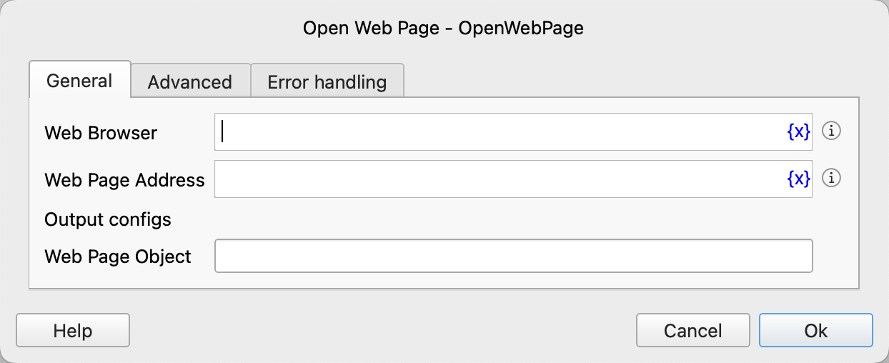
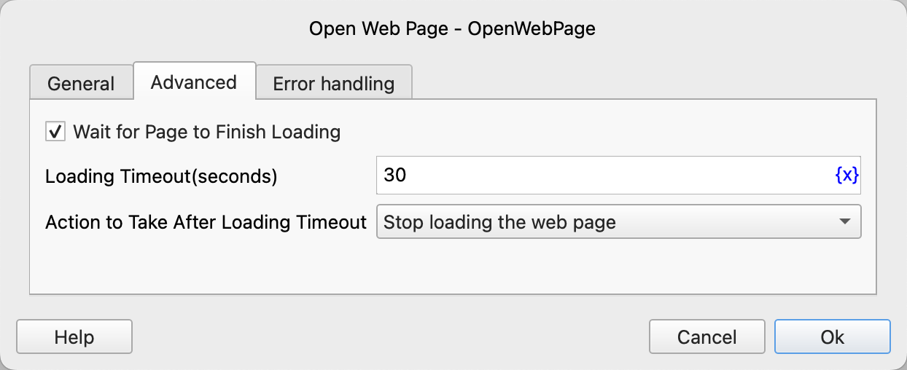

# Open Web Page

Open the specified web page.

## Instruction Configuration

### Web Browser

Select the web browser in which to open the web page.

### Web Page Address

Enter the address of the web page that needs to be opened.

### Web Page Object

Enter the name of the process variable used to save the web page object.

### Wait for Page to Finish Loading

Select whether to wait for the page to finish loading.

### Loading Timeout

Set the page loading timeout in seconds.

### Action to Take After Loading Timeout

Set the action to take after the loading times out:

- Stop loading the web page
- Execute error handling

### Error Handling

If an error occurs during the execution of the instruction, execute error handling. For details, see [Error Handling of Instructions](../../manual/error_handling.md).
