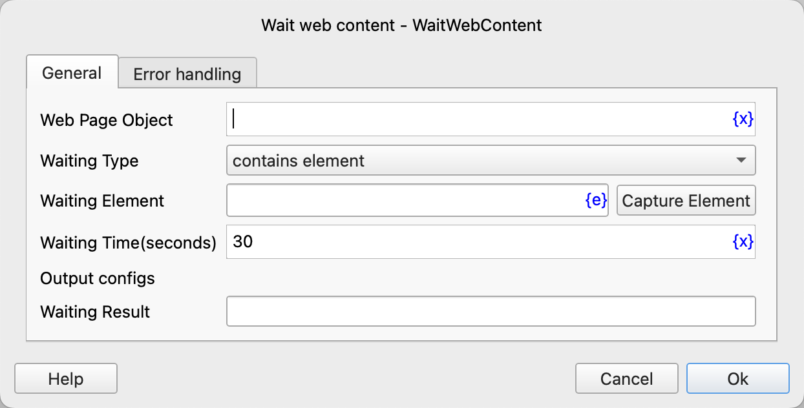

# Wait Web Page Content

Wait for the web page content to meet the specified conditions, and then execute subsequent instructions.

## Instruction Configuration

### Web Page Object

Enter the web page object variable.

### Waiting Type

The waiting type can be selected from: contains element, does not contain element, contains text, does not contain text, element is visible, element is invisible, text is visible, text is invisible.

### Waiting Element

Select a web element from the element library, or click the "Capture Element" button to call the tool to obtain it. For details, please refer to [Web Element Capture Tool](../../manual/web_element_capture_tool.md).

### Waiting Text

The text content to wait for.

### Waiting Time

The timeout for waiting for the web page content to meet the specified conditions, in seconds.

If the timeout occurs, the instruction will report an error and call the error handling.

### Waiting Result

Enter the name of the process variable used to save the waiting result. This result is a boolean variable. If the condition is met, the value is true; otherwise, it is false.

### Error Handling

If the waiting times out or an error occurs during the execution of the instruction, error handling will be executed. For details, please refer to [Error Handling of Instructions](../../manual/error_handling.md).
