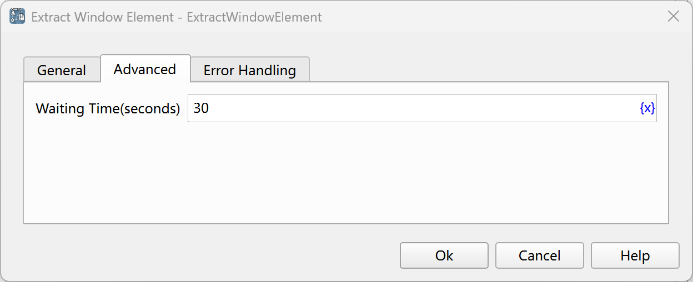

# Obtain Window Element Information

Obtain various types of data of window elements, such as element content, element attributes, etc.

## Instruction Configuration

### Window Element

Select a window element from the element library, or click the "Capture Element" button to call the tool for acquisition. For details, please refer to [Window Element Capture Tool](../../../manual/window_element_capture_tool.md).

### Extraction Type

- Element Text Content: Obtain the text content of the element.
- Element Value: Obtain the values of input components such as input boxes, combo boxes, checkboxes, and radio buttons.
- Element Attribute Value: Obtain the value of the specified attribute.
- Element Position: Obtain the coordinate position of the element relative to the upper left corner of the desktop, with the unit being pixels. The extraction result is a dictionary containing two fields, x and y.

### Attribute Name

When the extraction type is "Element Attribute Value", enter the attribute name to be obtained, or click the "Select" button to select from the element attribute list.

### Extraction Result

Enter the variable name used to save the extraction result.

### Waiting Time

The time to wait for the window element to appear, with the unit being seconds.

### Error Handling

If an error occurs during the execution of the instruction, perform error handling. For details, see [Error Handling of Instructions](../../../manual/error_handling.md).