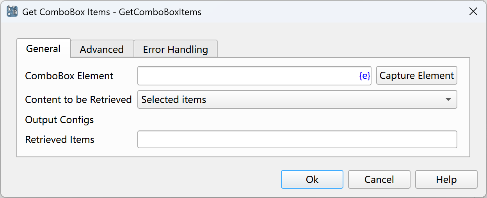
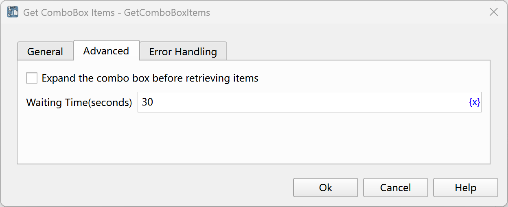

# Get ComboBox Items

Get the currently selected or all options of the ComboBox.

## Instruction Configuration

### ComboBox Element

Select a ComboBox element from the element library, or click the "Capture Element" button to use the tool to obtain it. For details, please refer to [Window Element Capture Tool](../../../manual/window_element_capture_tool.md).

### Content to be Retrieved

- Selected Items: Get the currently selected items.
- All Items: Get all items.

### Retrieved Items

Enter the variable name used to save the list of retrieved items.

### Expand the ComboBox Before Retrieving Items

Some ComboBoxes can only have their items retrieved after being expanded. You can check this option to make the instruction retrieve items after the ComboBox is expanded.

### Waiting Time

The time to wait for the window element to appear, in seconds.

### Error Handling

If an error occurs during the execution of the instruction, error handling will be performed. For details, see [Error Handling of Instructions](../../../manual/error_handling.md).