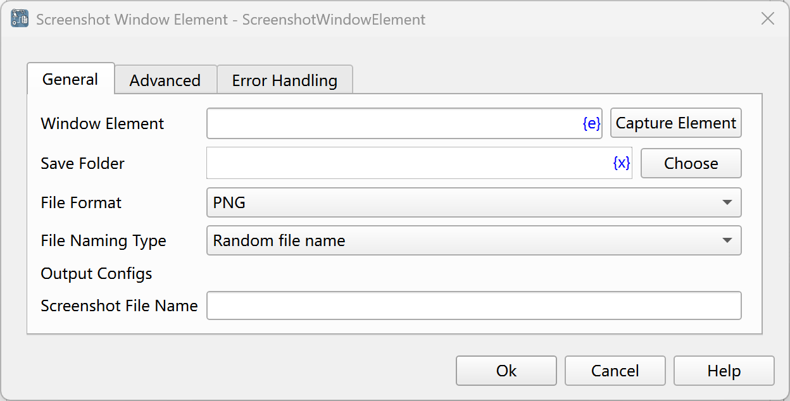
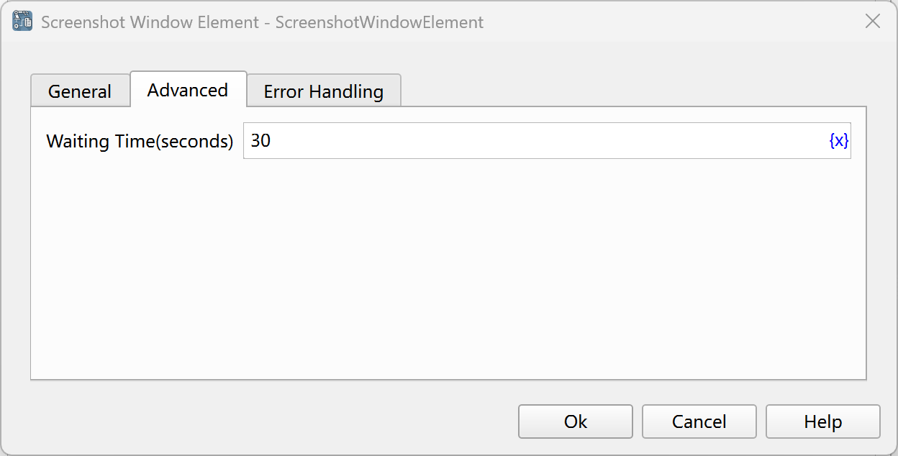

# Window Element Screenshot

Take a screenshot of a window element.

## Instruction Configuration

### Window Element
Select a window element from the element library, or click the "Capture Element" button to use the tool to obtain it. For details, please refer to [Window Element Capture Tool](../../../manual/window_element_capture_tool.md).

### Save Folder
Enter or select the folder path to save the screenshot file.

### File Format
Select the format to save the screenshot file. PNG and JPEG formats are supported.

### File Naming Type
Select the file naming method, either a random file name or a custom file name.

### Custom File Name
If you choose a custom file name, enter the custom file name.

### Overwrite Existing File
If you choose a custom file name, select whether to overwrite files with the same name.

### Screenshot File Name
Enter the variable name used to save the screenshot file path.

### Waiting Time
The time to wait for the window element to appear, in seconds.

### Error Handling
If an error occurs during the execution of the instruction, perform error handling. For details, see [Error Handling of Instructions](../../../manual/error_handling.md).